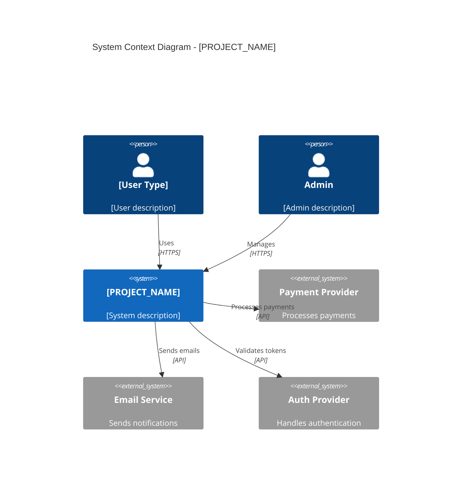
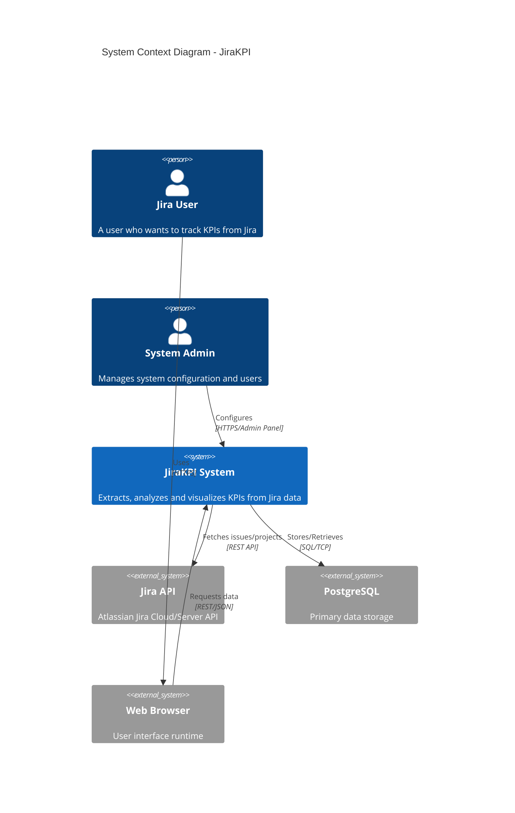

# Phase 2: System Context (C4 Level 1)

## Overview

Define what the system does at a high level and identify all external actors (people, systems) that interact with it. Generate a C4 Context diagram.

## Actions

1. Identify the system's primary purpose (1-2 sentences)
2. List all external actors (end-users by role, external systems)
3. Map inbound and outbound data flows
4. Generate C4Context Mermaid diagram
5. Create interaction summary table

## Patterns to Detect

### User Roles
Search for authentication/authorization code:
```
grep -rE "(role|permission|admin|user|customer|guest)" --include="*.ts" --include="*.js" --include="*.py"
```

### External Systems
Search for API clients and integrations:
```
grep -rE "(stripe|aws|s3|sendgrid|twilio|auth0|firebase|google|facebook|github)" --include="*.ts" --include="*.js" --include="*.py"
```

### Webhooks
```
grep -rE "webhook" --include="*.ts" --include="*.js" --include="*.py"
```

## Output Section

Populates: `## 2. System Context (C4 Level 1)`

### System Purpose
Write 1-2 sentences answering:
- What business problem does this solve?
- Who are the primary users?

### C4Context Diagram Template



### Actor / System Interactions Table

| Actor / System | Type | Interaction Summary |
|----------------|------|---------------------|
| End User | Person | Interacts via web UI to [action] |
| Admin | Person | Manages [resources] via admin panel |
| Stripe API | External System | Processes payments via webhook/API |
| SendGrid | External System | Sends transactional emails |

### Data Flows Table

| Direction | Data | Source/Destination | Format | Trigger |
|-----------|------|-------------------|--------|---------|
| Inbound | User input | End User | JSON/FormData | HTTP POST |
| Outbound | Email | SendGrid | JSON | API call |
| Inbound | Webhook | Stripe | JSON | HTTP POST |

## Grep Commands

```bash
# Find user types/roles
grep -rE "role|UserRole|UserRoleType|userType" --include="*.ts" --include="*.js" --include="*.py"

# Find external API integrations
grep -rE "api\.(stripe|twilio|sendgrid|aws|firebase)" --include="*.ts" --include="*.js" --include="*.py"

# Find webhook endpoints
grep -rE "webhook|callback" --include="*.ts" --include="*.js" --include="*.py"

# Find environment-based external services
grep -E "API_URL|API_KEY|SERVICE_URL" .env.example 2>/dev/null
```

## Actor Type Taxonomy

### Person Types
| Type | Description | Detection Pattern |
|------|-------------|-------------------|
| End User | Public/registered users accessing the system | Public routes, user auth |
| Admin | System administrators with elevated access | `admin`, `isAdmin`, role checks |
| Support Agent | Customer service representatives | `support`, `agent` roles |
| API Consumer | External developers using APIs | API key auth, rate limiting |
| System Admin | Infrastructure operators | Deployment configs, health checks |

### External System Types
| Type | Description | Examples |
|------|-------------|----------|
| Payment Provider | Financial transaction processing | Stripe, PayPal, Braintree |
| Email Service | Transactional/marketing emails | SendGrid, Mailgun, AWS SES |
| Auth Provider | Identity and access management | Auth0, Firebase, Cognito |
| Cloud Storage | File/object storage | AWS S3, GCS, Azure Blob |
| Database | Data persistence | PostgreSQL, MongoDB |
| Cache | Data caching | Redis, Memcached |
| Queue | Message/Job processing | RabbitMQ, Kafka, SQS |
| External API | Third-party data/services | Jira, Slack, GitHub |

### Internal System Types
| Type | Description | Detection Pattern |
|------|-------------|-------------------|
| Auth Service | Internal authentication microservice | `/auth`, JWT validation |
| Analytics Service | Data collection and reporting | Analytics endpoints |
| Worker Service | Background job processing | Queue consumers, Celery |

## Data Flow Identification

### Inbound Data Flows

| Source | Detection Pattern | Data Type |
|--------|-------------------|-----------|
| User Forms | `<form>`, FormData, POST routes | Structured input |
| API Requests | REST endpoints, GraphQL | JSON payloads |
| Webhooks | `/webhook`, callback routes | Event payloads |
| File Uploads | `multipart/form-data`, S3 presigned | Binary files |
| Real-time | WebSocket, SSE connections | Event streams |

### Outbound Data Flows

| Destination | Detection Pattern | Data Type |
|-------------|-------------------|-----------|
| External APIs | `axios`, `httpx`, `fetch` calls | JSON requests |
| Email | `sendgrid`, `mailgun` imports | Email templates |
| Storage | `s3.upload`, file writes | Binary files |
| Webhooks | Outbound POST requests | Event notifications |
| Analytics | `track`, `identify` calls | Event data |

## Complete C4Context Example (Jira KPI Project)



## Actor Interaction Table (Detailed Format)

### 2.1 Actor / System Interactions

| Actor / System | Type | Interaction Summary |
|----------------|------|---------------------|
| Jira User | Person | Accesses the web application to view KPI dashboards, configure reports, and track team metrics |
| System Admin | Person | Manages user accounts, configures Jira connections, and monitors system health via admin endpoints |
| Jira API | External System | Provides issue, project, and user data via REST API; receives read requests from the system |
| PostgreSQL | External System | Stores user configurations, cached Jira data, and generated reports via TCP connection |
| Web Browser | External System | Renders React UI, handles user input, and communicates with backend via HTTPS/JSON |

### 2.2 Data Flows

| Direction | Data | Source/Destination | Format | Trigger |
|-----------|------|-------------------|--------|---------|
| Inbound | User credentials | End User | JSON | Login POST |
| Inbound | Report config | End User | JSON | Save settings |
| Inbound | Jira issues | Jira API | JSON | Scheduled sync |
| Outbound | KPI reports | End User | JSON/Excel | HTTP GET |
| Outbound | API requests | Jira API | JSON | Data fetch |

## Discovery Questions

When analyzing the codebase, answer these questions:

### User Identification
1. What routes/pages are publicly accessible?
2. What routes require authentication?
3. What routes require admin privileges?
4. Are there different user roles (customer, admin, support)?

### External Systems
1. What external APIs does the system call?
2. What webhooks does the system receive?
3. What databases/services does it connect to?
4. What third-party SDKs are used?

### Data Flows
1. What data enters the system?
2. What data leaves the system?
3. What triggers each data flow?
4. What format is the data in?

## Self-Check

- [ ] System purpose clearly stated (1-2 sentences)
- [ ] All user roles identified
- [ ] All external systems listed
- [ ] C4Context diagram generated with all actors
- [ ] Interaction table complete
- [ ] Data flows documented (inbound/outbound)
- [ ] All referenced external systems exist in code
- [ ] Mermaid diagram syntax validated
- [ ] Discovery questions answered
