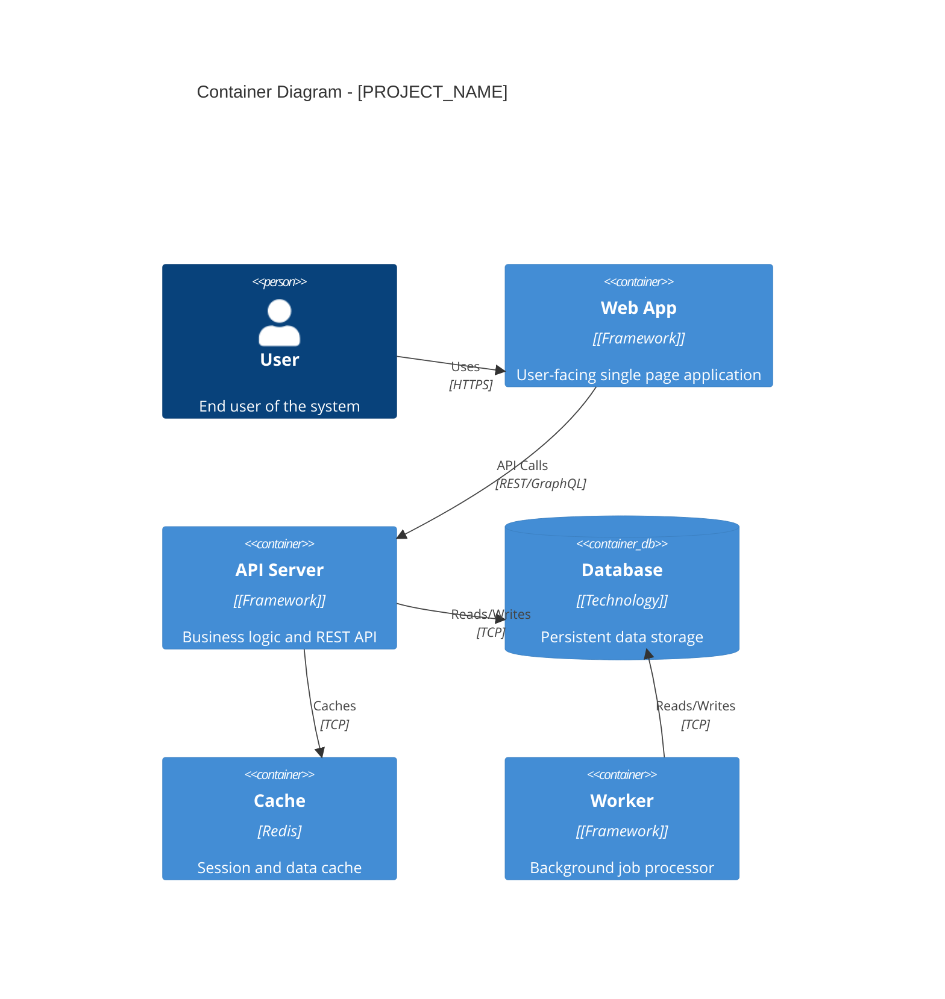

# Phase 3: Container Architecture (C4 Level 2)

## Overview

Map the high-level deployable/runnable units (containers) and their communication patterns. Generate a C4 Container diagram.

## Automated Analysis

Use the container discovery script for automated analysis:

```bash
# JSON output
python scripts/container_discovery.py /path/to/project

# Markdown output with diagram
python scripts/container_discovery.py /path/to/project --format markdown --diagram
```

## Actions

1. Identify all containers (frontend, backend, database, cache, workers)
2. Document technology stack for each container
3. Map communication protocols between containers
4. Generate C4Container Mermaid diagram
5. Create container details table

## Patterns to Detect

### Frontend Containers
```
package.json with "next", "react", "vue" → Frontend SPA/SSR
pages/, app/, src/pages/                  → Next.js/Nuxt
public/index.html                         → Static frontend
```

### Backend Containers
```
src/index.ts, server.ts, app.ts           → API server
api/, routes/, controllers/               → REST API
graphql/, resolvers/                      → GraphQL
```

### Database Containers
```
docker-compose.yml services with "postgres", "mysql", "mongodb"
prisma/schema.prisma                      → Prisma database
migrations/                               → Migration-based DB
```

### Worker/Queue Containers
```
workers/, jobs/, queues/                  → Background workers
celery.py, tasks.py                       → Celery workers
bull/, bee-queue                          → Node.js queues
```

### Cache Containers
```
redis in docker-compose.yml
ioredis, redis client in code
```

## Output Section

Populates: `## 3. Container Architecture (C4 Level 2)`

### C4Container Diagram Template



### Container Details Table

| Container | Technology | Responsibility | Communicates With | Port |
|-----------|------------|----------------|-------------------|------|
| Web App | React 18 | User interface | API Server | 3000 |
| API Server | Node.js/Express | Business logic | Database, Cache | 8080 |
| Database | PostgreSQL | Data persistence | - | 5432 |
| Cache | Redis | Session/cache | - | 6379 |

### Communication Protocols Table

| From | To | Protocol | Purpose |
|------|-----|----------|---------|
| Web App | API Server | REST/HTTPS | API requests |
| API Server | Database | TCP/PostgreSQL wire | Data queries |
| API Server | Cache | TCP/Redis protocol | Caching |
| Worker | Database | TCP | Job data access |

## Grep Commands

```bash
# Find docker containers
grep -A5 "image:" docker-compose.yml 2>/dev/null

# Find ports exposed
grep -E "ports:|expose:" docker-compose.yml 2>/dev/null

# Find frontend framework
grep -E '"(react|vue|angular|svelte|next|nuxt)"' package.json

# Find backend framework
grep -E '"(express|fastify|nestjs|fastapi|django|flask)"' package.json requirements.txt

# Find database clients
grep -E "(mongoose|pg|mysql2|redis|ioredis|prisma)" package.json requirements.txt
```

## Self-Check

- [ ] All containers identified (frontend, backend, DB, cache, workers)
- [ ] Technology stack documented for each container
- [ ] Communication protocols mapped
- [ ] C4Container diagram generated
- [ ] Container details table complete
- [ ] Ports/URLs documented where discoverable
