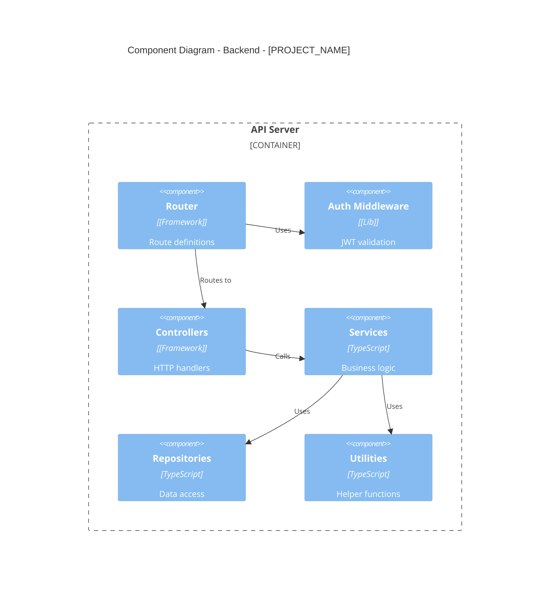

# Phase 4: Component Breakdown (C4 Level 3)

## Overview

Zoom into containers (primarily backend) and decompose into architectural layers, modules, and components. Generate C4 Component diagram.

## Automated Analysis

Use the component breakdown script for automated analysis:

```bash
# JSON output
python scripts/component_breakdown.py /path/to/project

# Markdown output with frontend analysis
python scripts/component_breakdown.py /path/to/project --format markdown --frontend

# Include C4Component diagram
python scripts/component_breakdown.py /path/to/project --format markdown --diagram --frontend
```

## Actions

1. Identify architectural layers (controllers, services, repositories, middleware)
2. List all major modules/controllers and their domains
3. Document cross-cutting concerns (auth, logging, error handling)
4. Generate C4Component Mermaid diagram
5. Create component registry table

## Patterns to Detect

### Layer Patterns

```
# Controllers / Routes
controllers/, routes/, api/, handlers/
src/controllers/, src/routes/

# Services / Business Logic
services/, usecases/, domain/, business/
src/services/, src/usecases/

# Repositories / Data Access
repositories/, dao/, models/, data/
src/repositories/, src/models/

# Middleware
middleware/, middlewares/, interceptors/
src/middleware/

# Utilities
utils/, lib/, helpers/, common/
src/utils/, src/lib/
```

### Module Detection
```
# REST controllers
grep -rE "(router|Router|controller|Controller)" --include="*.ts" --include="*.js"

# GraphQL resolvers
grep -rE "(resolver|Resolver|@Resolver)" --include="*.ts" --include="*.js"

# Service classes
grep -rE "(service|Service|@Service|@Injectable)" --include="*.ts" --include="*.js"
```

### Cross-Cutting Concerns
```
# Authentication
grep -rE "(auth|authenticate|jwt|passport|token)" --include="*.ts" --include="*.js" --include="*.py"

# Authorization
grep -rE "(authorize|permission|guard|role|canActivate)" --include="*.ts" --include="*.js"

# Error handling
grep -rE "(error|Error|exception|Exception|catch)" --include="*.ts" --include="*.js" --include="*.py"

# Logging
grep -rE "(logger|winston|pino|bunyan|log4js)" --include="*.ts" --include="*.js"

# Validation
grep -rE "(validate|validator|joi|zod|class-validator)" --include="*.ts" --include="*.js"
```

## Output Section

Populates: `## 4. Component Breakdown (C4 Level 3)`

### C4Component Diagram Template



### Component Registry Table

| Component | Layer | File Path(s) | Responsibility |
|-----------|-------|--------------|----------------|
| AuthController | Controller | `src/controllers/auth.controller.ts` | Login, register, token refresh |
| UserController | Controller | `src/controllers/user.controller.ts` | User CRUD operations |
| AuthService | Service | `src/services/auth.service.ts` | Authentication logic |
| UserService | Service | `src/services/user.service.ts` | User business logic |
| UserRepository | Repository | `src/repositories/user.repository.ts` | User data access |
| authMiddleware | Middleware | `src/middleware/auth.ts` | JWT validation |
| errorHandler | Middleware | `src/middleware/error.ts` | Global error handling |

### Architectural Layers Table

| Layer | Purpose | Components |
|-------|---------|------------|
| Routes/Controllers | HTTP handling | [List all controllers] |
| Services/Use-Cases | Business logic | [List all services] |
| Repositories/DAOs | Data access | [List all repositories] |
| Middleware | Cross-cutting | [List middleware] |
| Utilities | Helpers | [List utilities] |

### Cross-Cutting Concerns Table

| Concern | Implementation | File Path |
|---------|----------------|-----------|
| Authentication | JWT with [library] | `src/middleware/auth.ts` |
| Authorization | Role-based | `src/middleware/roles.ts` |
| Error Handling | Global error handler | `src/middleware/error.ts` |
| Logging | [winston/pino/etc] | `src/utils/logger.ts` |
| Validation | [joi/zod/etc] | `src/middleware/validate.ts` |

## Grep Commands

```bash
# Find all controllers
find . -path ./node_modules -prune -o -name "*controller*" -print
find . -path ./node_modules -prune -o -name "*Controller*" -print

# Find all services
find . -path ./node_modules -prune -o -name "*service*" -print
find . -path ./node_modules -prune -o -name "*Service*" -print

# Find all middleware
find . -path ./node_modules -prune -o -path "*/middleware/*" -print

# Find route definitions
grep -rE "router\.(get|post|put|delete|patch)" --include="*.ts" --include="*.js" | head -50
```

## Self-Check

- [ ] All architectural layers identified
- [ ] All controllers/modules listed
- [ ] All services listed
- [ ] All repositories/DAOs listed
- [ ] Cross-cutting concerns documented
- [ ] C4Component diagram generated
- [ ] Component registry table complete
- [ ] All file paths verified to exist
- [ ] Frontend analysis included (if applicable)

## Frontend Analysis

### Framework Detection

| Framework | Detection Pattern |
|-----------|-------------------|
| React | `react`, `react-dom` in package.json, `.jsx/.tsx` files |
| Vue | `vue` in package.json, `.vue` files |
| Angular | `@angular/core` in package.json, `.component.ts` files |
| Svelte | `svelte` in package.json, `.svelte` files |
| Next.js | `next` in package.json, `pages/` or `app/` directory |

### State Management Detection

| Library | Detection Pattern |
|---------|-------------------|
| Redux | `redux`, `@reduxjs/toolkit` in package.json |
| Zustand | `zustand` in package.json, `*Store.ts` files |
| Pinia | `pinia` in package.json (Vue) |
| Vuex | `vuex` in package.json (Vue) |
| MobX | `mobx` in package.json |
| React Context | `createContext`, `useContext` patterns |

### Routing Detection

| Router | Detection Pattern |
|--------|-------------------|
| React Router | `react-router`, `react-router-dom` imports |
| Vue Router | `vue-router` imports |
| Next.js | File-based: `pages/` or `app/` directory |
| Angular Router | `@angular/router` imports |

### Frontend Component Organization

**Atomic Design:**
```
src/
├── atoms/        # Basic UI elements
├── molecules/    # Combinations of atoms
├── organisms/    # Complex components
├── templates/    # Page layouts
└── pages/        # Complete pages
```

**Feature-Based:**
```
src/
├── features/
│   ├── auth/
│   │   ├── components/
│   │   ├── hooks/
│   │   └── api/
│   └── products/
├── components/   # Shared components
└── pages/        # Route pages
```

### Frontend Output Tables

#### Routing Structure

| Route | Component | File |
|-------|-----------|------|
| / | Home | `src/pages/index.tsx` |
| /login | Login | `src/pages/login.tsx` |
| /dashboard | Dashboard | `src/pages/dashboard/index.tsx` |

#### State Management

| Store | Type | File |
|-------|------|------|
| authStore | Zustand | `src/store/authStore.ts` |
| cartStore | Redux | `src/store/cartSlice.ts` |
| uiStore | Context | `src/contexts/UIContext.tsx` |

#### Component Groups

| Group | Components | Description |
|-------|------------|-------------|
| Layout | Header, Footer, Sidebar | Page structure |
| Forms | Input, Select, Button | Form elements |
| Auth | LoginForm, RegisterForm | Authentication |

