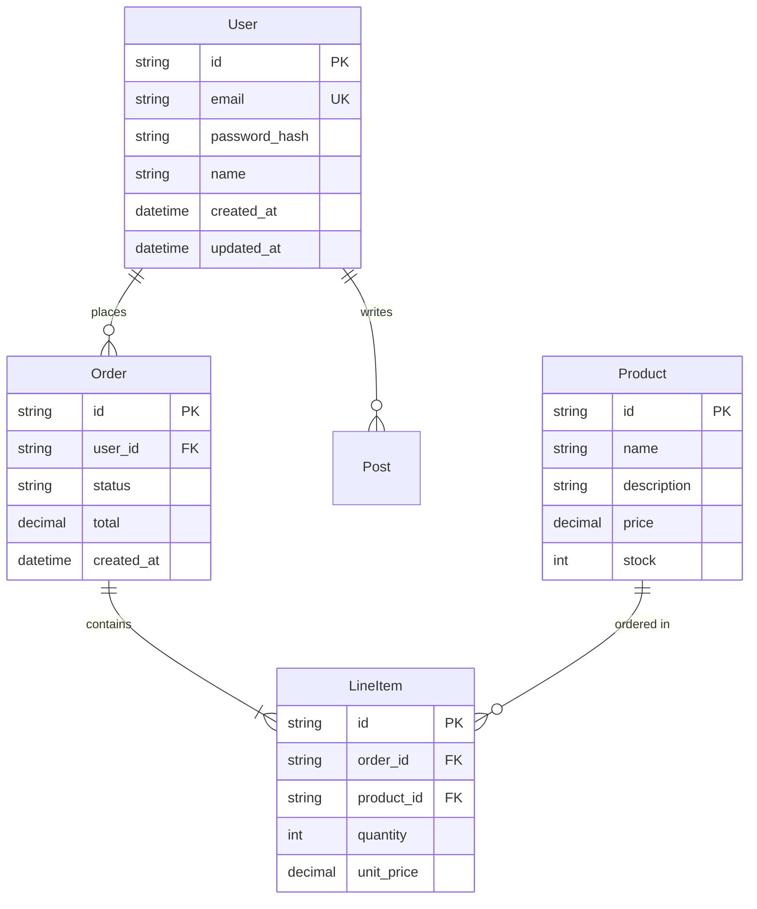

# Phase 5: Data Layer & Schema

## Overview

Document the complete database structure including tables/collections, columns/fields, relationships, indexes, and constraints. Generate ER diagram.

## Actions

1. Locate schema definitions (migrations, ORM models, schema files)
2. Document each table/collection with columns, types, constraints
3. Map relationships (foreign keys, references)
4. Generate erDiagram for visualization
5. Document cache/store patterns if applicable

## Files to Scan

### SQL Databases
```
migrations/               → Migration files
prisma/schema.prisma      → Prisma schema
db/schema.sql            → SQL schema
models/                  → ORM models
```

### NoSQL Databases
```
models/                  → Mongoose schemas
schemas/                 → Schema definitions
db/schemas/              → Collection schemas
```

### ORM/ODM Detection
```
sequelize models: models/*.js with sequelize.define
typeorm entities: entities/*.ts with @Entity
prisma: prisma/schema.prisma
mongoose: models/*.js with new Schema
sqlalchemy: models/*.py with declarative_base
django: models.py with models.Model
```

## Output Section

Populates: `## 5. Data Layer & Schema Reference`

### ER Diagram Template



### Table Schema Template

#### [TABLE_NAME]

| Column | Type | Nullable | Default | Constraints | Description |
|--------|------|----------|---------|-------------|-------------|
| id | UUID | NO | gen_random_uuid() | PRIMARY KEY | Unique identifier |
| name | VARCHAR(255) | NO | - | - | Display name |
| email | VARCHAR(255) | NO | - | UNIQUE | User email |
| created_at | TIMESTAMP | NO | NOW() | - | Creation timestamp |
| updated_at | TIMESTAMP | NO | NOW() | - | Update timestamp |

**Indexes:**
| Name | Columns | Type | Purpose |
|------|---------|------|---------|
| idx_email | email | UNIQUE | Fast email lookup |
| idx_created | created_at | INDEX | Sorting by date |

**Foreign Keys:**
| Column | References | On Delete | On Update |
|--------|------------|-----------|-----------|
| user_id | users.id | CASCADE | CASCADE |

### ORM/ODM Models Table

| Model | File Path | Table/Collection | Key Methods |
|-------|-----------|------------------|-------------|
| User | `src/models/user.model.ts` | users | findByEmail, validatePassword |
| Order | `src/models/order.model.ts` | orders | calculateTotal, addItem |

### Cache Store Documentation

| Key Pattern | TTL | Purpose | Data Structure |
|-------------|-----|---------|----------------|
| `session:{id}` | 24h | User sessions | JSON object |
| `cache:user:{id}` | 1h | User profile cache | JSON object |
| `rate:{ip}` | 1m | Rate limiting | Counter |

## Grep Commands

```bash
# Find Prisma schema
cat prisma/schema.prisma 2>/dev/null

# Find TypeORM entities
find . -name "*.entity.ts" -o -name "*.Entity.ts"

# Find Sequelize models
grep -r "sequelize.define\|DataTypes\." --include="*.js" --include="*.ts"

# Find Mongoose schemas
grep -r "new Schema\|mongoose.Schema" --include="*.js" --include="*.ts"

# Find SQLAlchemy models
grep -r "Column\|ForeignKey\|relationship" --include="*.py"

# Find Django models
grep -r "models\.Model\|models\.CharField\|models\.ForeignKey" --include="*.py"

# Find migration files
find . -path "*/migrations/*" -name "*.sql" -o -name "*.ts" -o -name "*.py"

# Find foreign key relationships
grep -rE "ForeignKey|references|belongsTo|hasMany|references:" --include="*.ts" --include="*.js" --include="*.py"
```

## Self-Check

- [ ] All tables/collections documented
- [ ] All columns/fields with types
- [ ] Primary keys identified
- [ ] Foreign keys/relationships mapped
- [ ] Indexes documented
- [ ] ER diagram generated
- [ ] ORM/ODM models listed
- [ ] Cache patterns documented if applicable
- [ ] All referenced files exist
