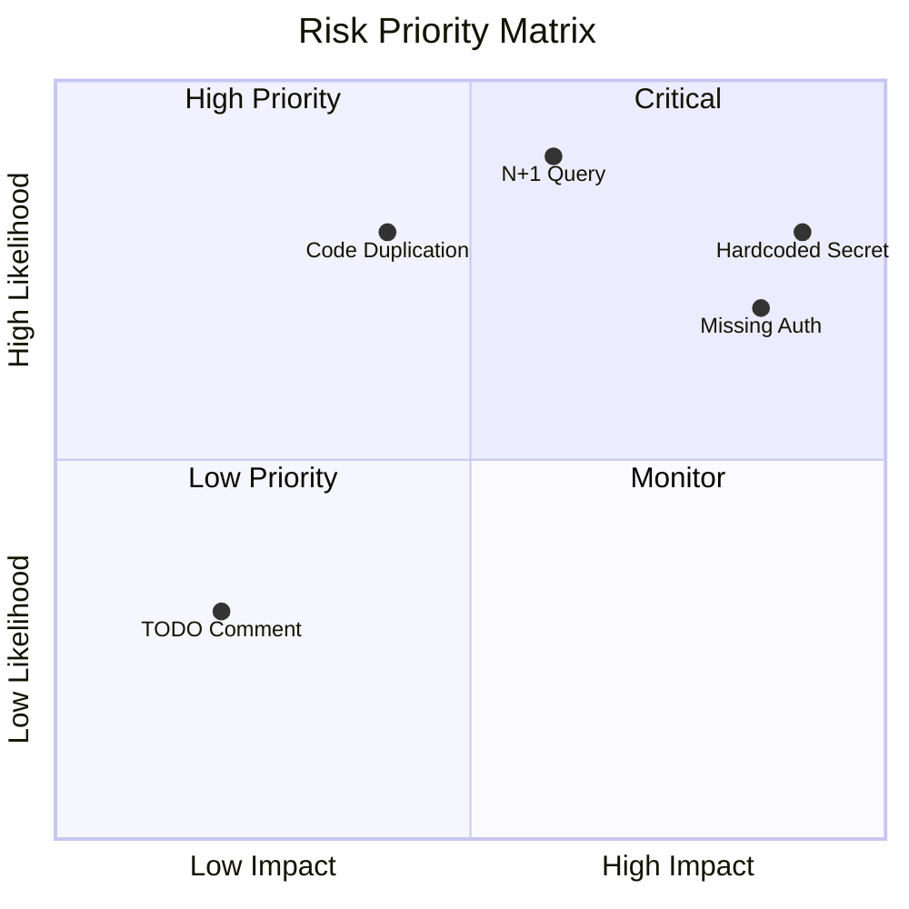

# Phase 8: Technical Debt & Risk Register

## Overview

Identify and document technical debt, security concerns, deprecated dependencies, and fragile logic. Assign severity levels for prioritization.

## Actions

1. Scan for code smells (duplicated logic, missing error handling, hardcoded values)
2. Check for deprecated dependencies
3. Identify security vulnerabilities
4. Flag fragile logic (complex conditionals, race conditions, tight coupling)
5. Assign severity levels (Low, Medium, High, Critical)

## Patterns to Detect

### Code Smells

```
# Duplicated code
Similar code blocks in multiple files

# Missing error handling
async function without try/catch
Promise without .catch()
no error handling in callbacks

# Hardcoded values
API keys, passwords in code
Magic numbers without constants
Hardcoded URLs/hosts

# TODO/FIXME comments
TODO:, FIXME:, HACK:, XXX:

# Unused code
Unreachable code
Unused imports
Commented-out code blocks
```

### Security Concerns

```
# SQL injection risk
String concatenation in SQL queries
Raw query with user input

# XSS risk
innerHTML usage
dangerouslySetInnerHTML (React)

# Sensitive data exposure
console.log with sensitive data
Error messages with stack traces in production
Passwords/secrets in logs

# Authentication issues
Missing auth checks on sensitive routes
Weak password requirements
No rate limiting on auth endpoints

# Dependency vulnerabilities
npm audit
pip-audit
```

### Deprecated Dependencies

```
# Check for outdated packages
npm outdated
pip list --outdated

# Check for known vulnerabilities
npm audit
yarn audit
pip-audit
```

### Fragile Logic

```
# Complex conditionals
Deeply nested if statements
Many conditions in single if

# Race conditions
Shared mutable state
No locks on concurrent access

# Tight coupling
Direct imports across layers
Circular dependencies

# Missing validation
No input validation
No type checking
```

## Output Section

Populates: `## 8. Technical Debt & Risk Register`

### Technical Debt Table

| # | Location | Issue | Severity | Suggested Fix | Notes |
|---|----------|-------|----------|---------------|-------|
| 1 | `src/services/payment.ts:45` | Missing error handling for Stripe webhook | High | Add try/catch with retry logic | Could crash on webhook failure |
| 2 | `src/utils/helpers.ts:12-45` | Duplicated validation logic | Medium | Extract to shared validator | Found in 3 files |
| 3 | `src/config/constants.ts:8` | Hardcoded API URL | Low | Move to environment variable | |

### Deprecated Dependencies Table

| Package | Current | Latest | Severity | Notes |
|---------|---------|--------|----------|-------|
| `express` | 4.17.1 | 4.18.2 | Low | Minor version behind |
| `lodash` | 4.17.15 | 4.17.21 | Medium | Security fix in 4.17.21 |
| `node-fetch` | 2.x | 3.x | High | ESM only in v3, breaking change |

### Security Concerns Table

| # | Location | Concern | Severity | Recommendation |
|---|----------|---------|----------|----------------|
| 1 | `src/routes/auth.ts:23` | No rate limiting on login | High | Add rate limiting middleware |
| 2 | `src/controllers/user.ts:56` | SQL via string concat | Critical | Use parameterized queries |
| 3 | `.env.example` | JWT_SECRET has weak example | Medium | Add minimum length requirement |

### Fragile Logic Table

| # | Location | Issue | Risk | Suggested Improvement |
|---|----------|-------|------|----------------------|
| 1 | `src/services/order.ts:78-95` | Complex nested conditionals | Maintenance burden | Extract to separate functions |
| 2 | `src/cache/index.ts:12` | No cache invalidation strategy | Stale data | Add TTL or event-based invalidation |
| 3 | `src/models/user.ts` | Tight coupling to payment service | Changes break both | Use dependency injection |

## Grep Commands

```bash
# Find TODO/FIXME comments
grep -rE "TODO:|FIXME:|HACK:|XXX:" --include="*.ts" --include="*.js" --include="*.py"

# Find hardcoded secrets (potential)
grep -rE "(password|secret|api_key|apikey)\s*=\s*['\"]" --include="*.ts" --include="*.js" --include="*.py"

# Find console.log (production debug risk)
grep -rE "console\.(log|debug|info)" --include="*.ts" --include="*.js"

# Find SQL string concatenation (injection risk)
grep -rE "\+\s*.*\+.*SELECT|INSERT|UPDATE|DELETE" --include="*.ts" --include="*.js" --include="*.py"

# Find innerHTML usage (XSS risk)
grep -rE "innerHTML|dangerouslySetInnerHTML" --include="*.ts" --include="*.js" --include="*.jsx" --include="*.tsx"

# Find async without error handling
grep -rE "async.*\{" --include="*.ts" --include="*.js" | grep -v "try"

# Find commented out code
grep -rE "^\s*//.*(\{|function|const|let|var|import)" --include="*.ts" --include="*.js"

# Check outdated packages
npm outdated --json 2>/dev/null || echo "Run npm outdated manually"

# Check for known vulnerabilities
npm audit --json 2>/dev/null || echo "Run npm audit manually"

# Find missing error handling in promises
grep -rE "\.then\(" --include="*.ts" --include="*.js" | grep -v "\.catch\|catch"

# Find deeply nested code (indentation check)
grep -rE "^\t{4,}" --include="*.ts" --include="*.js" --include="*.py"
```

## Risk Assessment Matrix

### Severity Levels

| Severity | Description | Action Required | Response Time |
|----------|-------------|-----------------|---------------|
| **Critical** | Immediate threat to security or data integrity | Fix immediately | < 24 hours |
| **High** | Major impact on functionality or performance | Fix within sprint | < 1 week |
| **Medium** | Notable impact on code quality or maintainability | Schedule for next sprint | < 2 weeks |
| **Low** | Minor issues with minimal impact | Fix when convenient | Backlog |

### Risk Categories

#### Security
Issues that could lead to security vulnerabilities:
- Hardcoded credentials/secrets
- SQL injection risks
- XSS vulnerabilities
- Insecure authentication
- Missing input validation
- Exposed sensitive data

#### Performance
Issues that impact system performance:
- N+1 query problems
- Missing database indexes
- Memory leaks
- Inefficient algorithms
- Missing caching
- Large bundle sizes

#### Maintainability
Issues that make code harder to maintain:
- Code duplication
- Complex/unclear logic
- Missing documentation
- Inconsistent patterns
- Poor naming
- Tight coupling

#### Reliability
Issues that could cause system failures:
- Missing error handling
- Race conditions
- Resource leaks
- Missing tests
- Fragile logic
- External dependency risks

### Classification Criteria

#### Critical Severity

| Category | Criteria | Example |
|----------|----------|---------|
| Security | Credentials in code, auth bypass, SQL injection | `const API_KEY = 'secret123'` |
| Reliability | Data loss risk, crash on error, unhandled fatal errors | No transaction on payment processing |

#### High Severity

| Category | Criteria | Example |
|----------|----------|---------|
| Security | Missing auth check, XSS risk, eval usage | No auth middleware on /admin routes |
| Performance | N+1 queries, missing critical index, memory leaks | Loading all users in memory |
| Reliability | Unhandled async errors, promise rejections | `await fetch()` without try/catch |

#### Medium Severity

| Category | Criteria | Example |
|----------|----------|---------|
| Maintainability | Duplicated logic, complex code, deep nesting | Same validation in 5 places |
| Performance | Suboptimal queries, missing pagination | Missing pagination on list endpoint |
| Reliability | Missing edge case handling, debug logging | No validation on user input |

#### Low Severity

| Category | Criteria | Example |
|----------|----------|---------|
| Maintainability | TODO comments, style issues, commented code | `// TODO: Refactor this` |
| Performance | Minor optimization opportunities | Using `var` instead of `const` |
| Reliability | Minor error handling gaps, type issues | Use of `any` type |

### Risk Score Calculation

**Formula:** Risk Score = Impact × Likelihood

**Impact Values:**
- Critical: 4
- High: 3
- Medium: 2
- Low: 1

**Likelihood Values:**
- Almost Certain: 4
- Likely: 3
- Possible: 2
- Unlikely: 1

**Risk Score Ranges:**
- 13-16: Critical (Fix immediately)
- 9-12: High (Fix this sprint)
- 5-8: Medium (Schedule soon)
- 1-4: Low (Backlog)

### Priority Matrix



## Severity Guidelines

| Level | Criteria |
|-------|----------|
| **Critical** | Security vulnerability, data loss risk, production crash potential |
| **High** | Significant bug risk, major maintainability issues, security concerns |
| **Medium** | Code quality issues, minor security concerns, deprecated but functional |
| **Low** | Style issues, minor improvements, nice-to-have fixes |

## Self-Check

- [ ] All TODO/FIXME comments catalogued
- [ ] Security concerns identified
- [ ] Deprecated dependencies listed
- [ ] Fragile logic documented
- [ ] Severity levels assigned appropriately
- [ ] Suggestions for fixes provided
- [ ] All referenced files/lines verified
