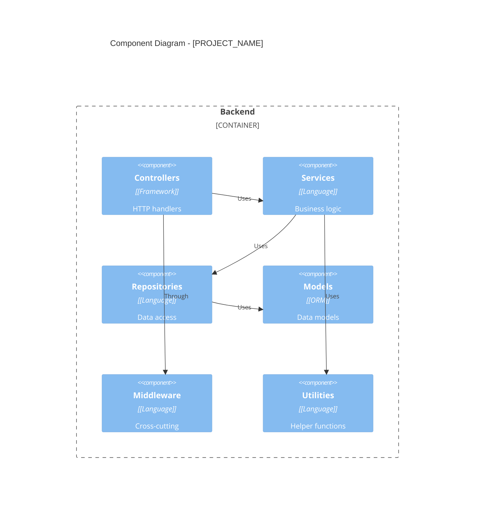
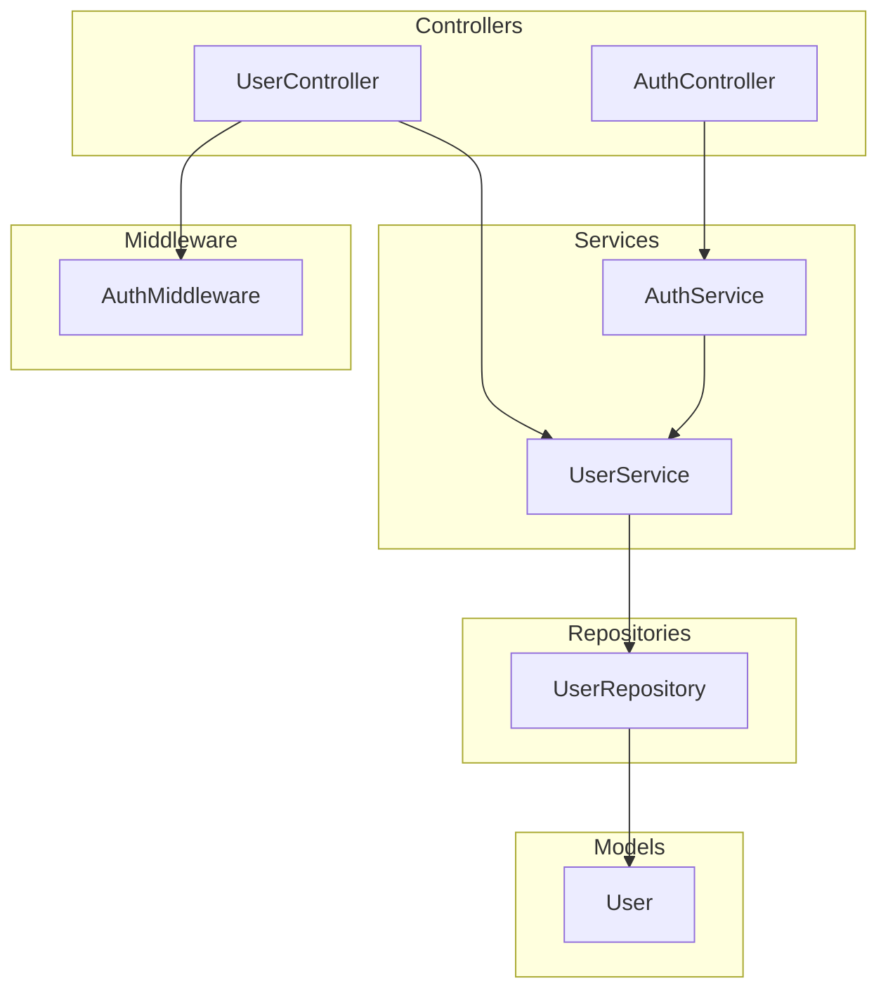

# Component Registry: [PROJECT_NAME]

> **Generated by:** Architecture Audit Agent
> **Date:** [YYYY-MM-DD]
> **Total Components:** [N]
> **Files Analyzed:** [M]

---

## Table of Contents
- [Architecture Overview](#architecture-overview)
- [Component Layers](#component-layers)
- [Component Details](#component-details)
- [Dependency Graph](#dependency-graph)
- [Index](#index)
- [Coverage Report](#coverage-report)

---

## Architecture Overview

### Layer Distribution

| Layer | Components | Files |
|-------|------------|-------|
| Controllers | [N] | [M] |
| Services | [N] | [M] |
| Repositories | [N] | [M] |
| Models | [N] | [M] |
| Middleware | [N] | [M] |
| Utilities | [N] | [M] |
| Schemas | [N] | [M] |

### C4 Component Diagram

---

## Component Layers

### Controllers / Routes

| Component | File | Endpoints | Description |
|-----------|------|-----------|-------------|
| [ControllerName] | `path/to/controller.py` | [N] | [Description] |

### Services

| Component | File | Methods | Description |
|-----------|------|---------|-------------|
| [ServiceName] | `path/to/service.py` | [N] | [Description] |

### Repositories

| Component | File | Tables | Description |
|-----------|------|--------|-------------|
| [RepositoryName] | `path/to/repo.py` | [tables] | [Description] |

### Models

| Component | File | Table | Description |
|-----------|------|-------|-------------|
| [ModelName] | `path/to/model.py` | [table] | [Description] |

### Middleware

| Component | File | Purpose | Description |
|-----------|------|---------|-------------|
| [MiddlewareName] | `path/to/middleware.py` | [Purpose] | [Description] |

### Utilities

| Component | File | Functions | Description |
|-----------|------|-----------|-------------|
| [UtilName] | `path/to/util.py` | [N] | [Description] |

### Schemas / DTOs

| Component | File | Fields | Description |
|-----------|------|--------|-------------|
| [SchemaName] | `path/to/schema.py` | [N] | [Description] |

---

## Component Details

### [COMPONENT_NAME]

**File:** `path/to/file.py`

**Layer:** [Controller|Service|Repository|Model|Middleware|Utility|Schema]

**Description:** [Extended description from docstring]

**Exports:**

| Name | Type | Line | Description |
|------|------|------|-------------|
| [ClassName] | class | [N] | [Description] |
| [functionName] | function | [N] | [Description] |

**Classes:**

| Class | Extends | Description |
|-------|---------|-------------|
| [ClassName] | [BaseClass] | [Description] |

**Methods:**

| Method | Signature | Description |
|--------|-----------|-------------|
| [methodName] | `methodName(param: Type) -> ReturnType` | [Description] |

**Dependencies:**

- `path/to/dependency1.py`
- `path/to/dependency2.py`

**Used By:**

- `path/to/consumer1.py`
- `path/to/consumer2.py`

---

## Dependency Graph

### Dependency Matrix

| From | To | Type |
|------|-----|------|
| UserController | UserService | import |
| UserService | UserRepository | import |
| UserService | User | import |
| AuthController | AuthService | import |
| AuthMiddleware | UserService | import |

---

## Index

### By Name

| Component | Layer | File |
|-----------|-------|------|
| [AuthController] | Controller | `path/to/auth.py` |
| [AuthService] | Service | `path/to/auth.py` |
| [User] | Model | `path/to/user.py` |
| [UserController] | Controller | `path/to/user.py` |
| [UserRepository] | Repository | `path/to/user_repo.py` |
| [UserService] | Service | `path/to/user.py` |

### By File

| File | Components |
|------|------------|
| `path/to/controllers/user.py` | UserController |
| `path/to/services/user.py` | UserService |
| `path/to/models/user.py` | User |
| `path/to/repositories/user.py` | UserRepository |

### By Layer

| Layer | Components |
|-------|------------|
| Controller | AuthController, UserController |
| Service | AuthService, UserService |
| Repository | UserRepository |
| Model | User |
| Middleware | AuthMiddleware |

---

## Coverage Report

| Metric | Value |
|--------|-------|
| Files Analyzed | [N] |
| Components Found | [M] |
| With Descriptions | [X%] |
| With Dependencies | [Y%] |
| With Inheritance Info | [Z%] |

### Missing Information

| Component | Missing |
|-----------|---------|
| [ComponentName] | Description |
| [ComponentName] | Dependencies |

---

## Cross-Cutting Concerns

| Concern | Implementation | File Path |
|---------|----------------|-----------|
| Authentication | [AuthImplementation] | `path/to/auth.py` |
| Authorization | [AuthzImplementation] | `path/to/authorization.py` |
| Error Handling | [ErrorHandler] | `path/to/errors.py` |
| Logging | [Logger] | `path/to/logger.py` |
| Validation | [Validator] | `path/to/validators.py` |

---

## Frontend Components (if applicable)

### Framework Detection

| Property | Value |
|----------|-------|
| Framework | [React/Vue/Angular/Svelte] |
| State Management | [Redux/Zustand/Context/Pinia/etc] |
| Router | [React Router/Vue Router/Next.js/etc] |

### Routing Structure

| Route | Component | File |
|-------|-----------|------|
| `/` | Home | `src/pages/index.tsx` |
| `/login` | Login | `src/pages/login.tsx` |
| `/dashboard` | Dashboard | `src/pages/dashboard/index.tsx` |

### State Management

| Store | Type | File |
|-------|------|------|
| authStore | Zustand | `src/store/authStore.ts` |
| userStore | Redux | `src/store/userSlice.ts` |

### Component Groups

| Group | Components | Description |
|-------|------------|-------------|
| Layout | Header, Footer, Sidebar | Page structure |
| Forms | Input, Select, Button | Form elements |
| Auth | LoginForm, RegisterForm | Authentication |

---

*Document generated by Architecture Audit Agent*
