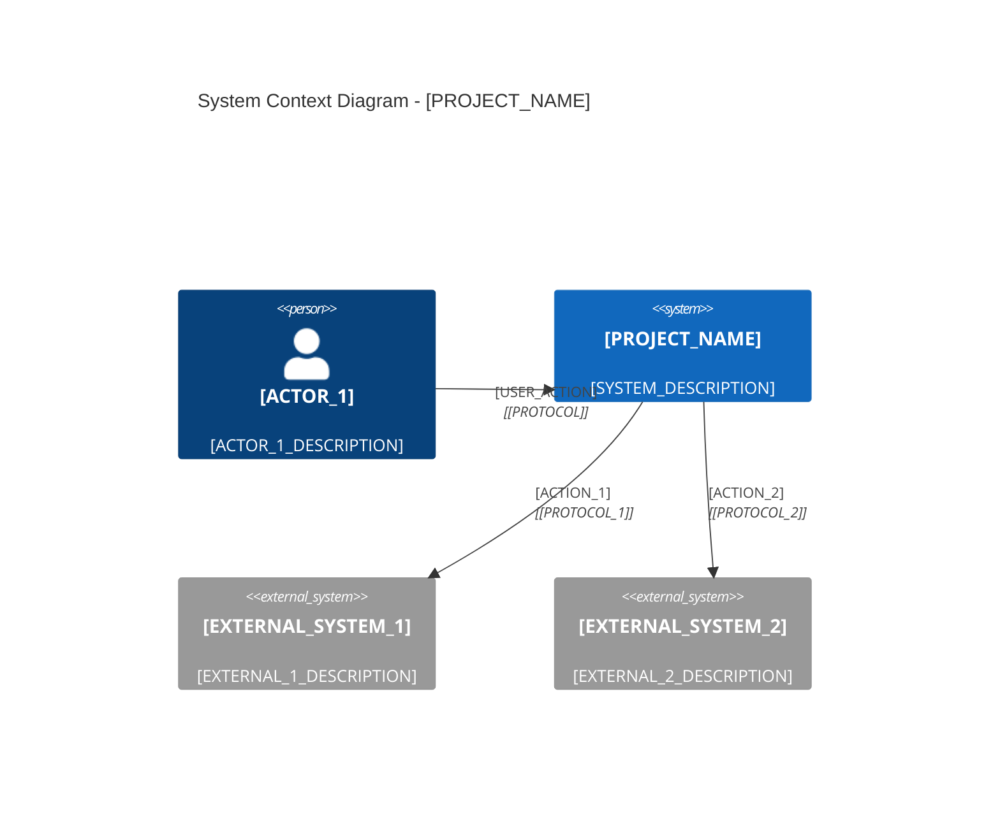
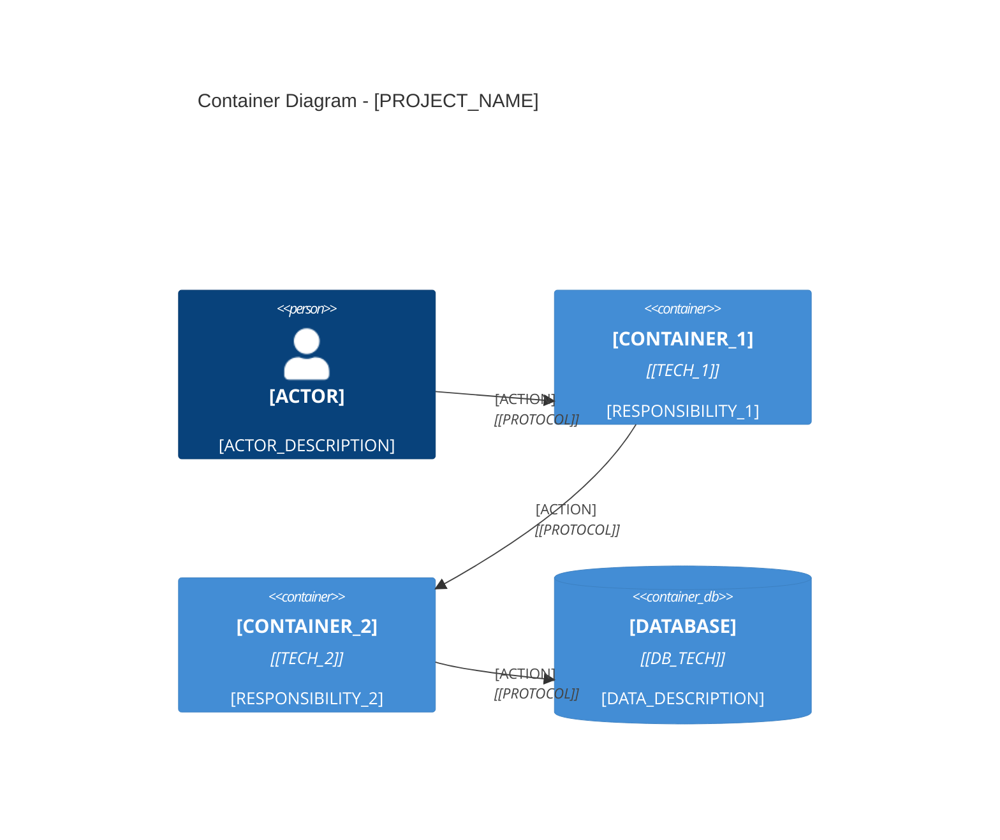
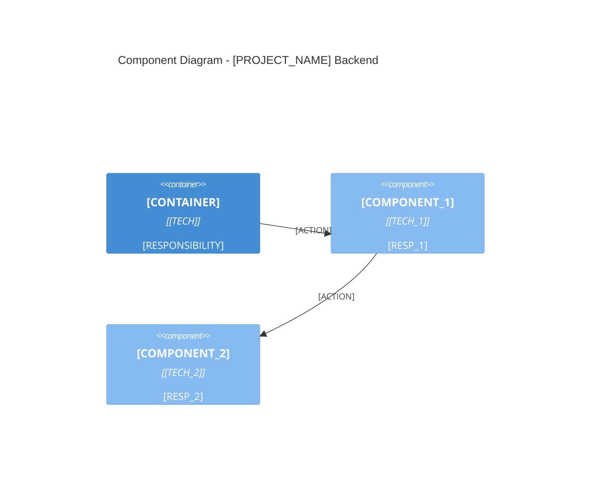
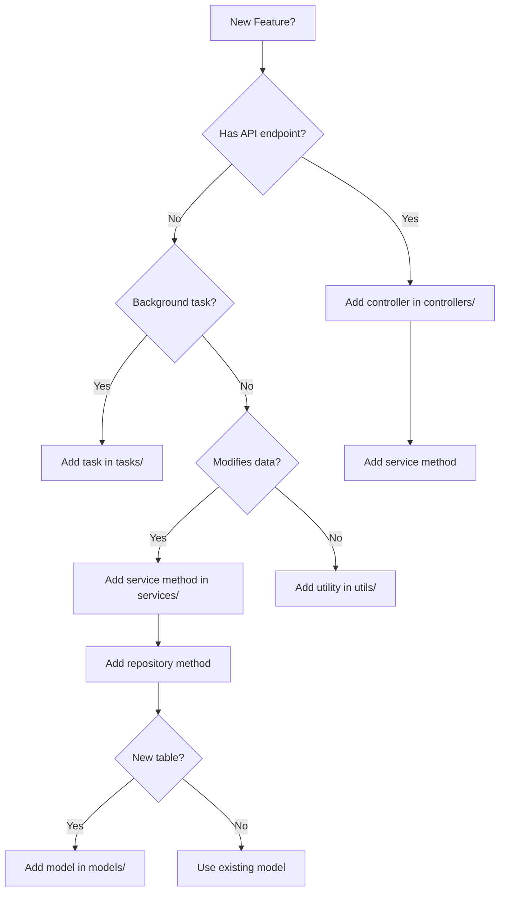

# System Architecture & Logic Reference: [PROJECT_NAME]

> **Generated by:** Architecture Audit Agent
> **Date:** [YYYY-MM-DD]
> **Codebase Version:** [COMMIT_HASH] ([BRANCH])
> **Document Version:** 1.0

This document provides a complete technical mapping of **[PROJECT_NAME]** for AI-driven development and human onboarding.

**Detected Tech Stack:** [TECH_STACK_SUMMARY]

---

## Quick Reference

### Tech Stack

| Category | Technology | Version |
|----------|------------|---------|
| Language | [LANGUAGE] | [VERSION] |
| Framework | [FRAMEWORK] | [VERSION] |
| Database | [DATABASE] | [VERSION] |
| ORM | [ORM] | [VERSION] |
| Cache | [CACHE] | [VERSION] |

### Key Metrics

| Metric | Value |
|--------|-------|
| Total Files | [TOTAL_FILES] |
| Components | [COMPONENT_COUNT] |
| API Endpoints | [ENDPOINT_COUNT] |
| Database Tables | [TABLE_COUNT] |

### Quick Links

- [Executive Summary](#executive-summary)
- [Architecture Overview](#1-architecture-overview)
- [System Context (C4 Level 1)](#2-system-context-c4-level-1)
- [Container Architecture (C4 Level 2)](#3-container-architecture-c4-level-2)
- [Component Breakdown (C4 Level 3)](#4-component-breakdown-c4-level-3)
- [Feature Catalog](#5-feature-catalog)
- [API Reference](#6-api-reference)
- [Data Layer](#7-data-layer)
- [Developer Guide](#8-developer-guide)
- [Technical Debt](#9-technical-debt)
- [AI Reference](#10-ai-reference)

---

## Executive Summary

### System Purpose

[SYSTEM_PURPOSE_DESCRIPTION]

### Key Capabilities

1. **[CAPABILITY_1_NAME]**: [CAPABILITY_1_DESCRIPTION]
2. **[CAPABILITY_2_NAME]**: [CAPABILITY_2_DESCRIPTION]
3. **[CAPABILITY_3_NAME]**: [CAPABILITY_3_DESCRIPTION]
4. **[CAPABILITY_4_NAME]**: [CAPABILITY_4_DESCRIPTION]

### Architecture Highlights

- **Pattern**: [ARCHITECTURE_PATTERN]
- **Key Decisions**: [KEY_DECISIONS]
- **External Dependencies**: [EXTERNAL_DEPENDENCIES]

---

## Table of Contents

1. [Architecture Overview](#1-architecture-overview)
2. [System Context (C4 Level 1)](#2-system-context-c4-level-1)
3. [Container Architecture (C4 Level 2)](#3-container-architecture-c4-level-2)
4. [Component Breakdown (C4 Level 3)](#4-component-breakdown-c4-level-3)
5. [Feature Catalog](#5-feature-catalog)
6. [API Reference](#6-api-reference)
7. [Data Layer](#7-data-layer)
8. [Developer Guide](#8-developer-guide)
9. [Technical Debt](#9-technical-debt)
10. [AI Reference](#10-ai-reference)
11. [Appendices](#11-appendices)

---

## 1. Architecture Overview

### 1.1 Technology Manifest

| Category | Technology | Version | Purpose |
|----------|------------|---------|---------|
| [CATEGORY_1] | [TECH_1] | [VERSION_1] | [PURPOSE_1] |
| [CATEGORY_2] | [TECH_2] | [VERSION_2] | [PURPOSE_2] |

### 1.2 Project Structure

```
[PROJECT_NAME]/
├── [TOP_DIR_1]/           # [DESCRIPTION_1]
│   ├── [SUB_DIR_1]/       # [DESCRIPTION_2]
│   └── [SUB_DIR_2]/       # [DESCRIPTION_3]
├── [TOP_DIR_2]/           # [DESCRIPTION_4]
└── [TOP_DIR_3]/           # [DESCRIPTION_5]
```

### 1.3 Configuration Files

| File | Purpose |
|------|---------|
| [CONFIG_FILE_1] | [PURPOSE_1] |
| [CONFIG_FILE_2] | [PURPOSE_2] |

---

## 2. System Context (C4 Level 1)

### 2.1 System Purpose

[SYSTEM_PURPOSE_BULLETS]

### 2.2 Context Diagram



### 2.3 Actor / System Interactions

| Actor | System | Interaction | Data |
|-------|--------|-------------|------|
| [ACTOR_1] | [PROJECT_NAME] | [INTERACTION_1] | [DATA_1] |
| [ACTOR_2] | [PROJECT_NAME] | [INTERACTION_2] | [DATA_2] |

### 2.4 Inbound / Outbound Data Flows

| Direction | Source/Destination | Data | Format | Trigger |
|-----------|-------------------|------|--------|---------|
| Inbound | [SOURCE_1] | [DATA_1] | [FORMAT_1] | [TRIGGER_1] |
| Outbound | [DEST_1] | [DATA_2] | [FORMAT_2] | [TRIGGER_2] |

---

## 3. Container Architecture (C4 Level 2)

### 3.1 Container Diagram



### 3.2 Container Details

| Container | Technology | Responsibility | Communication | Port |
|-----------|------------|----------------|---------------|------|
| [CONTAINER_1] | [TECH_1] | [RESP_1] | [COMM_1] | [PORT_1] |
| [CONTAINER_2] | [TECH_2] | [RESP_2] | [COMM_2] | [PORT_2] |

### 3.3 Communication Protocols

| From | To | Protocol | Purpose |
|------|-----|----------|---------|
| [FROM_1] | [TO_1] | [PROTOCOL_1] | [PURPOSE_1] |
| [FROM_2] | [TO_2] | [PROTOCOL_2] | [PURPOSE_2] |

---

## 4. Component Breakdown (C4 Level 3)

### 4.1 Component Diagram



### 4.2 Component Registry

| Component | Layer | File Path | Responsibility |
|-----------|-------|-----------|----------------|
| [COMPONENT_1] | [LAYER_1] | [PATH_1] | [RESP_1] |
| [COMPONENT_2] | [LAYER_2] | [PATH_2] | [RESP_2] |

### 4.3 Architectural Layers

| Layer | Pattern | Components | Purpose |
|-------|---------|------------|---------|
| [LAYER_1] | [PATTERN_1] | [COMPS_1] | [PURPOSE_1] |
| [LAYER_2] | [PATTERN_2] | [COMPS_2] | [PURPOSE_2] |

### 4.4 Cross-Cutting Concerns

| Concern | Implementation | File Path |
|---------|----------------|-----------|
| [CONCERN_1] | [IMPL_1] | [PATH_1] |
| [CONCERN_2] | [IMPL_2] | [PATH_2] |

---

## 5. Feature Catalog

### 5.1 Feature Summary by Domain

| Domain | Features | Status |
|--------|----------|--------|
| [DOMAIN_1] | [FEATURE_COUNT_1] | [STATUS_1] |
| [DOMAIN_2] | [FEATURE_COUNT_2] | [STATUS_2] |

### 5.2 Feature Catalog

| Feature | UI Entry | API Endpoints | Backend Logic | DB Tables |
|---------|----------|---------------|---------------|-----------|
| [FEATURE_1] | [UI_1] | [API_1] | [LOGIC_1] | [TABLES_1] |
| [FEATURE_2] | [UI_2] | [API_2] | [LOGIC_2] | [TABLES_2] |

### 5.3 Feature Details

#### [FEATURE_1_NAME]

**Description:** [FEATURE_1_DESCRIPTION]

**User Flow:**
1. [STEP_1]
2. [STEP_2]
3. [STEP_3]

**Implementation:**
- Controller: `[CONTROLLER_PATH]`
- Service: `[SERVICE_PATH]`
- Repository: `[REPOSITORY_PATH]`

---

## 6. API Reference

### 6.1 Endpoint Summary

| Domain | Endpoints | Auth Required |
|--------|-----------|---------------|
| [DOMAIN_1] | [COUNT_1] | [AUTH_1] |
| [DOMAIN_2] | [COUNT_2] | [AUTH_2] |

### 6.2 API Endpoints

| Method | Path | Auth | Request Schema | Response Schema | Error Codes |
|--------|------|------|----------------|-----------------|-------------|
| [METHOD_1] | [PATH_1] | [AUTH_1] | [REQ_1] | [RES_1] | [ERRORS_1] |
| [METHOD_2] | [PATH_2] | [AUTH_2] | [REQ_2] | [RES_2] | [ERRORS_2] |

### 6.3 Request / Response Schemas

#### [SCHEMA_NAME]

**Request:**
```json
[REQUEST_SCHEMA_JSON]
```

**Response:**
```json
[RESPONSE_SCHEMA_JSON]
```

---

## 7. Data Layer

### 7.1 Database Configuration

| Property | Value |
|----------|-------|
| Database | [DATABASE_NAME] |
| Host | [HOST] |
| ORM | [ORM] |

### 7.2 Entity-Relationship Diagram

```mermaid
erDiagram
    [TABLE_1] {
        [COLUMN_1] [TYPE_1] [PK/FK]
        [COLUMN_2] [TYPE_2]
    }
    [TABLE_2] {
        [COLUMN_1] [TYPE_1] [PK/FK]
        [COLUMN_2] [TYPE_2]
    }
    [TABLE_1] ||--o{ [TABLE_2] : "[RELATIONSHIP]"
```

### 7.3 Table Schemas

#### [TABLE_NAME]

| Column | Type | Nullable | Default | Constraints |
|--------|------|----------|---------|-------------|
| [COLUMN_1] | [TYPE_1] | [YES/NO] | [DEFAULT_1] | [CONSTRAINTS_1] |
| [COLUMN_2] | [TYPE_2] | [YES/NO] | [DEFAULT_2] | [CONSTRAINTS_2] |

**Indexes:** [INDEXES]

**Foreign Keys:** [FOREIGN_KEYS]

### 7.4 ORM Models

| Model | File Path | Table | Key Methods |
|-------|-----------|-------|-------------|
| [MODEL_1] | [PATH_1] | [TABLE_1] | [METHODS_1] |
| [MODEL_2] | [PATH_2] | [TABLE_2] | [METHODS_2] |

---

## 8. Developer Guide

### 8.1 Prerequisites

| Requirement | Version | Installation |
|-------------|---------|--------------|
| [REQ_1] | [VERSION_1] | `[INSTALL_CMD_1]` |
| [REQ_2] | [VERSION_2] | `[INSTALL_CMD_2]` |

### 8.2 Initial Setup

```bash
# 1. Clone repository
[CLONE_CMD]

# 2. Create virtual environment
[VENV_CMD]

# 3. Install dependencies
[INSTALL_DEPS_CMD]

# 4. Setup environment variables
[ENV_SETUP_CMD]

# 5. Create database
[DB_CREATE_CMD]

# 6. Run migrations
[MIGRATION_CMD]

# 7. Seed initial data (optional)
[SEED_CMD]

# 8. Start development server
[START_CMD]
```

### 8.3 Verify Setup

```bash
# Run tests
[TEST_CMD]

# Check linting
[LINT_CMD]

# Health check
[HEALTH_CMD]
```

### 8.4 Project Structure Guide

```
[PROJECT_NAME]/
├── [DIR_1]/                  # [DESCRIPTION_1]
│   ├── [FILE_1]              # [PURPOSE_1]
│   └── [DIR_1_1]/            # [DESCRIPTION_1_1]
├── [DIR_2]/                  # [DESCRIPTION_2]
└── [DIR_3]/                  # [DESCRIPTION_3]
```

### 8.5 Key Files to Understand

| File | Purpose | Start Here |
|------|---------|------------|
| [FILE_1] | [PURPOSE_1] | ✓ |
| [FILE_2] | [PURPOSE_2] | |
| [FILE_3] | [PURPOSE_3] | ✓ |

### 8.6 Common Development Tasks

#### Adding a New API Endpoint

1. **Create schema** in `[SCHEMA_DIR]/[FEATURE]_schemas.py`:
```python
class Create[ENTITY]Request(BaseModel):
    [FIELD_1]: [TYPE_1]
    [FIELD_2]: [TYPE_2]

class [ENTITY]Response(BaseModel):
    id: int
    [FIELD_1]: [TYPE_1]
```

2. **Add service method** in `[SERVICE_DIR]/[FEATURE]_service.py`:
```python
def create_[ENTITY](self, request: Create[ENTITY]Request) -> [ENTITY]:
    # Validate
    [VALIDATION_LOGIC]
    # Create
    [ENTITY] = [ENTITY](**request.dict())
    return self.repository.create([ENTITY])
```

3. **Add controller endpoint** in `[CONTROLLER_DIR]/[FEATURE]_controller.py`:
```python
@router.post("/[ENTITIES]", response_model=[ENTITY]Response)
async def create_[ENTITY](
    request: Create[ENTITY]Request,
    service: [ENTITY]Service = Depends(get_[ENTITY]_service)
):
    return service.create_[ENTITY](request)
```

4. **Add test** in `tests/[CONTROLLER_DIR]/test_[FEATURE]_controller.py`:
```python
def test_create_[ENTITY](client, mock_service):
    response = client.post("/[ENTITIES]", json={
        "[FIELD_1]": "[VALUE_1]",
        "[FIELD_2]": "[VALUE_2]"
    })
    assert response.status_code == 201
```

#### Adding a New Database Table

1. **Create model** in `[MODEL_DIR]/[ENTITY].py`
2. **Create migration**: `[MIGRATION_CMD]`
3. **Run migration**: `[MIGRATION_RUN_CMD]`
4. **Create repository** in `[REPO_DIR]/[ENTITY]_repository.py`
5. **Create service** in `[SERVICE_DIR]/[ENTITY]_service.py`

#### Running Tests

```bash
# All tests
[TEST_ALL_CMD]

# Specific file
[TEST_FILE_CMD]

# With coverage
[TEST_COVERAGE_CMD]

# Specific test
[TEST_SINGLE_CMD]
```

### 8.7 Debugging Guide

#### Common Issues

| Issue | Cause | Solution |
|-------|-------|----------|
| [ISSUE_1] | [CAUSE_1] | [SOLUTION_1] |
| [ISSUE_2] | [CAUSE_2] | [SOLUTION_2] |
| [ISSUE_3] | [CAUSE_3] | [SOLUTION_3] |

#### Debugging Tools

```bash
# Enable debug logging
[DEBUG_LOG_CMD]

# View database queries
[DB_DEBUG_CMD]

# Interactive debugger (add to code)
[DEBUGGER_CMD]
```

#### Useful Debug Endpoints

| Endpoint | Purpose |
|----------|---------|
| `GET /health` | Check service health |
| `GET /metrics` | Application metrics |
| `GET /debug/routes` | List all routes |

### 8.8 Architecture Decision Records

#### ADR-001: [DECISION_TITLE_1]

**Status:** [STATUS_1]

**Context:**
[CONTEXT_1]

**Decision:**
[DECISION_1]

**Consequences:**
- (+) [PRO_1]
- (+) [PRO_2]
- (-) [CON_1]
- (-) [CON_2]

#### ADR-002: [DECISION_TITLE_2]

**Status:** [STATUS_2]

**Context:**
[CONTEXT_2]

**Decision:**
[DECISION_2]

**Consequences:**
- (+) [PRO_1]
- (-) [CON_1]

### 8.9 Core User Flow / Happy Path

| Step | Action | Component | File Path |
|------|--------|-----------|-----------|
| 1 | [ACTION_1] | [COMP_1] | [PATH_1] |
| 2 | [ACTION_2] | [COMP_2] | [PATH_2] |
| 3 | [ACTION_3] | [COMP_3] | [PATH_3] |

### 8.10 Authentication & Authorization

| Aspect | Implementation | File Path |
|--------|----------------|-----------|
| Strategy | [AUTH_STRATEGY] | [AUTH_PATH] |
| Token Type | [TOKEN_TYPE] | [TOKEN_PATH] |
| Middleware | [MIDDLEWARE_NAME] | [MIDDLEWARE_PATH] |

### 8.11 Error Handling Patterns

| Pattern | Location | Example |
|---------|----------|---------|
| [PATTERN_1] | [LOCATION_1] | [EXAMPLE_1] |
| [PATTERN_2] | [LOCATION_2] | [EXAMPLE_2] |

---

## 9. Technical Debt

### 9.1 Technical Debt Register

| Issue | Severity | Location | Suggested Fix | Notes |
|-------|----------|----------|---------------|-------|
| [ISSUE_1] | [SEVERITY_1] | [LOCATION_1] | [FIX_1] | [NOTES_1] |
| [ISSUE_2] | [SEVERITY_2] | [LOCATION_2] | [FIX_2] | [NOTES_2] |

### 9.2 Deprecated Dependencies

| Package | Current | Latest | Severity |
|---------|---------|--------|----------|
| [PACKAGE_1] | [CURRENT_1] | [LATEST_1] | [SEVERITY_1] |
| [PACKAGE_2] | [CURRENT_2] | [LATEST_2] | [SEVERITY_2] |

### 9.3 Security Concerns

| Concern | Severity | Recommendation |
|---------|----------|----------------|
| [CONCERN_1] | [SEVERITY_1] | [REC_1] |
| [CONCERN_2] | [SEVERITY_2] | [REC_2] |

---

## 10. AI Reference

### 10.1 System Summary (for AI Prompts)

[AI_SYSTEM_SUMMARY]

Key architectural patterns:
- [PATTERN_1]
- [PATTERN_2]
- [PATTERN_3]

Main features:
- [FEATURE_1]
- [FEATURE_2]
- [FEATURE_3]

### 10.2 Component Summary (for AI Code Generation)

Controllers:
- [CONTROLLER_1]: [METHODS_1]
- [CONTROLLER_2]: [METHODS_2]

Services:
- [SERVICE_1]: [METHODS_1]
- [SERVICE_2]: [METHODS_2]

### 10.3 Entity Relationships (JSON)

```json
{
  "entities": [ENTITY_JSON_ARRAY]
}
```

### 10.4 API Endpoints (JSON)

```json
{
  "endpoints": [ENDPOINT_JSON_ARRAY]
}
```

### 10.5 Code Patterns

#### Creating a New Endpoint

```python
# 1. Create request/response schemas in schemas/
class Create[ENTITY]Request(BaseModel):
    [FIELD_1]: [TYPE_1]
    [FIELD_2]: [TYPE_2]

class [ENTITY]Response(BaseModel):
    id: int
    [FIELD_1]: [TYPE_1]

# 2. Create service method in services/
class [ENTITY]Service:
    def create(self, request: Create[ENTITY]Request) -> [ENTITY]:
        [BUSINESS_LOGIC]
        pass

# 3. Create controller in controllers/
@router.post("/[ENTITIES]", response_model=[ENTITY]Response)
async def create_[ENTITY](
    request: Create[ENTITY]Request,
    service: [ENTITY]Service = Depends(get_[ENTITY]_service)
):
    return service.create(request)
```

#### Adding a New Database Table

```python
# 1. Create model in models/
class [ENTITY](Base):
    __tablename__ = "[TABLE_NAME]"

    id = Column(Integer, primary_key=True)
    [COLUMN_1] = Column([TYPE_1])
    [COLUMN_2] = Column([TYPE_2])

# 2. Create migration
[MIGRATION_COMMAND]

# 3. Create repository in repositories/
class [ENTITY]Repository:
    def create(self, [ENTITY]: [ENTITY]) -> [ENTITY]:
        self.db.add([ENTITY])
        self.db.commit()
        return [ENTITY]
```

### 10.6 Decision Tree: Where to Add New Code?



### 10.7 Common Questions Context

#### Q: How do I find where a feature is implemented?

A: Follow this mapping:
1. API endpoints are in `[CONTROLLER_DIR]/`
2. Business logic is in `[SERVICE_DIR]/`
3. Database operations are in `[REPO_DIR]/`
4. Data models are in `[MODEL_DIR]/`

Example: Finding "[FEATURE_EXAMPLE]"
1. Start with endpoint: `[EXAMPLE_ENDPOINT]`
2. Handler: `[EXAMPLE_HANDLER]` in `[EXAMPLE_CONTROLLER_PATH]`
3. Service: `[EXAMPLE_SERVICE_METHOD]` in `[EXAMPLE_SERVICE_PATH]`
4. Repository: `[EXAMPLE_REPO_METHOD]` in `[EXAMPLE_REPO_PATH]`
5. Model: `[EXAMPLE_MODEL]` in `[EXAMPLE_MODEL_PATH]`

#### Q: How is authentication implemented?

A: [AUTH_IMPLEMENTATION_DESCRIPTION]
1. [AUTH_STEP_1]
2. [AUTH_STEP_2]
3. [AUTH_STEP_3]
4. [AUTH_STEP_4]

---

## 11. Appendices

### A. Environment Variables

| Variable | Purpose | Required | Default |
|----------|---------|----------|---------|
| [VAR_1] | [PURPOSE_1] | [YES/NO] | [DEFAULT_1] |
| [VAR_2] | [PURPOSE_2] | [YES/NO] | [DEFAULT_2] |

### B. Error Codes

| Code | Meaning |
|------|---------|
| [CODE_1] | [MEANING_1] |
| [CODE_2] | [MEANING_2] |

### C. Glossary

| Term | Definition |
|------|------------|
| [TERM_1] | [DEFINITION_1] |
| [TERM_2] | [DEFINITION_2] |

### D. Documentation Files

| File | Purpose |
|------|---------|
| [DOC_FILE_1] | [PURPOSE_1] |
| [DOC_FILE_2] | [PURPOSE_2] |

---

## Validation Report

### Schema Analysis

| Metric | Value |
|--------|-------|
| Tables Documented | [TABLE_COUNT] |
| Relationships Mapped | [REL_COUNT] |
| Coverage | [COVERAGE]% |

### Key Files Verified

| File | Status |
|------|--------|
| [FILE_1] | [STATUS_1] |
| [FILE_2] | [STATUS_2] |

---

## Document Metadata

```yaml
document:
  type: system-architecture-reference
  project: [PROJECT_NAME]
  generated: [TIMESTAMP]
  version: 1.0

analysis:
  files_analyzed: [FILES_COUNT]
  components_found: [COMPONENTS_COUNT]
  features_documented: [FEATURES_COUNT]

coverage:
  description_coverage: [DESC_COVERAGE]%
  component_coverage: [COMP_COVERAGE]%
  feature_coverage: [FEATURE_COVERAGE]%
```

---

*Document generated by Architecture Audit Agent*
