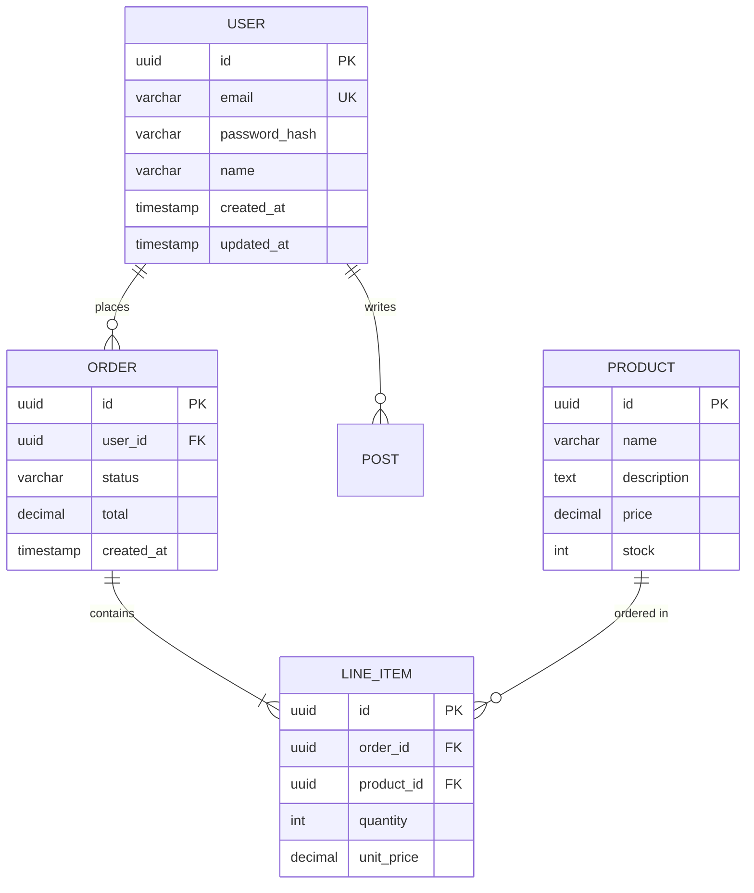

# Database Schema: [PROJECT_NAME]

> **Generated by:** Architecture Audit Agent
> **Date:** [YYYY-MM-DD]
> **Database:** [PostgreSQL/MySQL/MongoDB/etc]
> **ORM:** [Prisma/TypeORM/etc]

---

## Table of Contents

- [ER Diagram](#er-diagram)
- [Tables](#tables)
- [Relationships](#relationships)
- [Coverage Report](#coverage-report)

---

## ER Diagram

---

## Tables

### users

**Description:** [Table description from docstring]

**File:** `src/models/user.py`

**ORM:** [Prisma/TypeORM/etc]

| Column | Type | Nullable | Default | Constraints | Description |
|--------|------|----------|---------|-------------|-------------|
| id | UUID | NO | gen_random_uuid() | PRIMARY KEY | Unique identifier |
| email | VARCHAR(255) | NO | - | UNIQUE | User's email address |
| password_hash | VARCHAR(255) | NO | - | - | Hashed password |
| name | VARCHAR(100) | NO | - | - | Display name |
| created_at | TIMESTAMP | NO | NOW() | - | Creation timestamp |
| updated_at | TIMESTAMP | NO | NOW() | - | Update timestamp |

**Indexes:**

| Name | Columns | Type | Purpose |
|------|---------|------|---------|
| idx_users_email | email | UNIQUE | Fast email lookup |
| idx_users_created | created_at | INDEX | Sorting by date |

**Foreign Keys:** None

---

### orders

**Description:** [Table description from docstring]

**File:** `src/models/order.py`

**ORM:** [Prisma/TypeORM/etc]

| Column | Type | Nullable | Default | Constraints | Description |
|--------|------|----------|---------|-------------|-------------|
| id | UUID | NO | gen_random_uuid() | PRIMARY KEY | Unique identifier |
| user_id | UUID | NO | - | FK: users.id | Reference to user |
| status | VARCHAR(50) | NO | pending | - | Order status |
| total | DECIMAL(10,2) | NO | 0 | - | Total amount |
| created_at | TIMESTAMP | NO | NOW() | - | Creation timestamp |

**Indexes:**

| Name | Columns | Type | Purpose |
|------|---------|------|---------|
| idx_orders_user | user_id | INDEX | User's orders lookup |
| idx_orders_status | status | INDEX | Filter by status |

**Foreign Keys:**

| Column | References | On Delete | On Update |
|--------|------------|-----------|-----------|
| user_id | users.id | CASCADE | CASCADE |

---

### products

**Description:** [Table description from docstring]

**File:** `src/models/product.py`

**ORM:** [Prisma/TypeORM/etc]

| Column | Type | Nullable | Default | Constraints | Description |
|--------|------|----------|---------|-------------|-------------|
| id | UUID | NO | gen_random_uuid() | PRIMARY KEY | Unique identifier |
| name | VARCHAR(255) | NO | - | - | Product name |
| description | TEXT | YES | NULL | - | Product description |
| price | DECIMAL(10,2) | NO | 0 | - | Unit price |
| stock | INTEGER | NO | 0 | - | Available quantity |

**Indexes:**

| Name | Columns | Type | Purpose |
|------|---------|------|---------|
| idx_products_name | name | INDEX | Search by name |

**Foreign Keys:** None

---

### line_items

**Description:** [Table description from docstring]

**File:** `src/models/line_item.py`

**ORM:** [Prisma/TypeORM/etc]

| Column | Type | Nullable | Default | Constraints | Description |
|--------|------|----------|---------|-------------|-------------|
| id | UUID | NO | gen_random_uuid() | PRIMARY KEY | Unique identifier |
| order_id | UUID | NO | - | FK: orders.id | Reference to order |
| product_id | UUID | NO | - | FK: products.id | Reference to product |
| quantity | INTEGER | NO | 1 | - | Quantity ordered |
| unit_price | DECIMAL(10,2) | NO | - | - | Price at time of order |

**Indexes:**

| Name | Columns | Type | Purpose |
|------|---------|------|---------|
| idx_line_items_order | order_id | INDEX | Order items lookup |

**Foreign Keys:**

| Column | References | On Delete | On Update |
|--------|------------|-----------|-----------|
| order_id | orders.id | CASCADE | CASCADE |
| product_id | products.id | RESTRICT | CASCADE |

---

## Relationships

| From Table | From Column | To Table | To Column | Type | Description |
|------------|-------------|----------|-----------|------|-------------|
| orders | user_id | users | id | one-to-many | User has many orders |
| line_items | order_id | orders | id | one-to-many | Order has many line items |
| line_items | product_id | products | id | one-to-many | Product in many line items |

### Many-to-Many Relationships

| Relationship | Junction Table | Description |
|--------------|----------------|-------------|
| users ↔ products | line_items (via orders) | Users purchase products |

---

## ORM Models

| Model | Table | File Path | Key Methods |
|-------|-------|-----------|-------------|
| User | users | `src/models/user.py` | findByEmail, validatePassword, create |
| Order | orders | `src/models/order.py` | calculateTotal, addItem, processPayment |
| Product | products | `src/models/product.py` | updateStock, isAvailable |
| LineItem | line_items | `src/models/line_item.py` | getSubtotal |

---

## Coverage Report

| Metric | Value | Target | Status |
|--------|-------|--------|--------|
| Tables Documented | [N/M] | 100% | [✓/✗] |
| Columns with Descriptions | [X/Y] | >80% | [✓/✗] |
| Relationships Mapped | [N/M] | 100% | [✓/✗] |
| Indexes Documented | [N/M] | 100% | [✓/✗] |

### Missing Descriptions

| Table | Column | Issue |
|-------|--------|-------|
| [table_name] | [column_name] | No description |
| [table_name] | - | No table description |

---

## Cache Layer

| Key Pattern | TTL | Purpose | Data Structure |
|-------------|-----|---------|----------------|
| `session:{id}` | 24h | User sessions | JSON object |
| `cache:user:{id}` | 1h | User profile cache | JSON object |
| `cache:product:{id}` | 15m | Product details | JSON object |
| `rate:{ip}` | 1m | Rate limiting | Counter |

---

## Migration History

| Migration | Date | Description |
|-----------|------|-------------|
| 001_initial | [DATE] | Initial schema with users, products |
| 002_add_orders | [DATE] | Add orders and line_items tables |
| 003_add_indexes | [DATE] | Add performance indexes |

---

*Document generated by Architecture Audit Agent*
