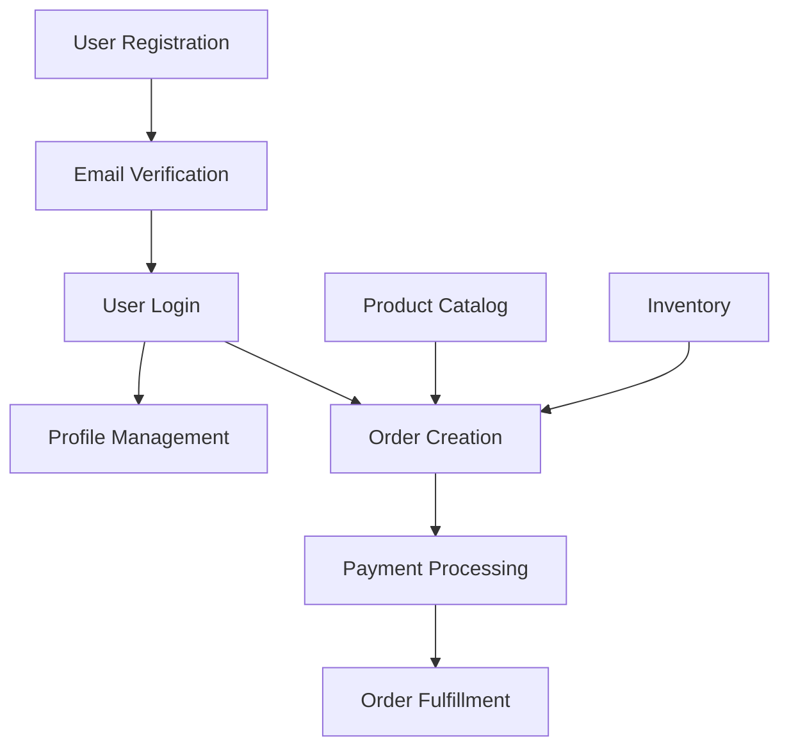

# Feature Catalog: [PROJECT_NAME]

> **Generated by:** Architecture Audit Agent
> **Date:** [YYYY-MM-DD]
> **Total Features:** [N]
> **API Endpoints:** [M]
> **Framework:** [FRAMEWORK]

---

## Table of Contents

- [Feature Overview](#feature-overview)
- [Feature Catalog](#feature-catalog)
- [Feature Details](#feature-details)
- [API Reference](#api-reference)
- [Feature Dependencies](#feature-dependencies)
- [Coverage Report](#coverage-report)

---

## Feature Overview

### Feature Summary by Domain

| Domain | Features | Endpoints | Coverage |
|--------|----------|-----------|----------|
| [Authentication] | [N] | [M] | [X%] |
| [Users] | [N] | [M] | [X%] |
| [Orders] | [N] | [M] | [X%] |
| [Products] | [N] | [M] | [X%] |

### Feature Categories

| Category | Count | Description |
|----------|-------|-------------|
| User-facing | [N] | Features directly used by end users |
| System | [N] | Background operations and maintenance |
| Admin | [N] | Administrative features |
| Integration | [N] | External service integrations |

### Feature Type Distribution

| Type | Count | Description |
|------|-------|-------------|
| API | [N] | REST API endpoints |
| Service | [N] | Service layer operations |
| Scheduled | [N] | Cron/scheduled jobs |
| Event | [N] | Event handlers/consumers |

---

## Feature Catalog

### All Features

| # | Feature Name | Category | Description | API Endpoints | Status |
|---|--------------|----------|-------------|---------------|--------|
| 1 | [Feature Name] | [Category] | [Brief description] | `POST /api/...` | ✓ |
| 2 | [Feature Name] | [Category] | [Brief description] | `GET /api/...` | ✓ |

### Features by Domain

#### Authentication

| Feature | Endpoints | Description |
|---------|-----------|-------------|
| User Registration | `POST /api/auth/register` | Create new user accounts |
| User Login | `POST /api/auth/login` | Authenticate users |
| Password Reset | `POST /api/auth/reset-password` | Reset user password |

#### User Management

| Feature | Endpoints | Description |
|---------|-----------|-------------|
| Get User | `GET /api/users/:id` | Retrieve user details |
| Update User | `PUT /api/users/:id` | Update user profile |
| Delete User | `DELETE /api/users/:id` | Remove user account |

---

## Feature Details

### 1. [Feature Name: User Registration]

**Category:** Authentication

**Business Description:**

[Allows new users to create an account in the system. This includes
email verification and initial profile setup.]

**Business Value:**

[Enables customer acquisition and user management]

**Entry Points:**

| Type | Path | Handler | File |
|------|------|---------|------|
| API | `POST /api/auth/register` | `register` | `auth.controller.ts` |
| API | `POST /api/auth/verify-email` | `verify_email` | `auth.controller.ts` |

**Workflow:**

1. User submits registration form
2. System validates email uniqueness
3. System creates inactive user account
4. System sends verification email
5. User clicks verification link
6. System activates account

**Validations:**

| Field | Rule | Description |
|-------|------|-------------|
| email | Valid email format, unique | Must be a valid email not already registered |
| password | Min 8 chars, contains number | Password strength requirements |
| name | Required, 2-100 chars | User's display name |

**Side Effects:**

| Type | Trigger | Description |
|------|---------|-------------|
| Email | On registration | Verification email sent |
| Audit | Always | Registration logged for audit |

**Error Scenarios:**

| Error | Description | User Message | HTTP Code |
|-------|-------------|--------------|-----------|
| EmailExistsError | Email already registered | "Email already in use" | 409 |
| InvalidEmailError | Invalid email format | "Please enter a valid email" | 400 |
| WeakPasswordError | Password doesn't meet requirements | "Password must be at least 8 characters" | 400 |

**Database Operations:**

| Table | Operation | Purpose |
|-------|-----------|---------|
| users | INSERT | Create user record |
| verification_tokens | INSERT | Store verification token |

**Related Features:**

- Email Verification
- User Login
- Password Reset

---

### 2. [Feature Name: Order Creation]

**Category:** Orders

**Business Description:**

[Create a new order for a user with item validation, payment processing,
and order confirmation.]

**Entry Points:**

| Type | Path | Handler | File |
|------|------|---------|------|
| API | `POST /api/orders` | `create_order` | `order.controller.ts` |

**Workflow:**

1. Validate item availability
2. Apply applicable discounts
3. Calculate shipping costs
4. Create payment intent
5. Reserve inventory
6. Send order confirmation

**Validations:**

| Field | Rule | Description |
|-------|------|-------------|
| items | At least 1 item | Order must contain items |
| items | Max 100 items | Order size limit |
| shipping_address | Valid address | Delivery address required |
| payment_method_id | Must exist | Valid payment method |

**Side Effects:**

| Type | Trigger | Description |
|------|---------|-------------|
| Email | After order creation | Order confirmation email |
| Webhook | Payment events | Payment provider notifications |
| Audit | Always | Order creation logged |

**Error Scenarios:**

| Error | Description | Handling |
|-------|-------------|----------|
| OutOfStockError | Items unavailable | Return unavailable items list |
| PaymentFailedError | Payment processing failed | Mark order as payment_failed |
| ValidationError | Invalid input data | Return validation errors |

---

## API Reference

### Authentication Endpoints

| Method | Endpoint | Auth | Feature | Description |
|--------|----------|------|---------|-------------|
| POST | `/api/auth/register` | No | User Registration | Create new account |
| POST | `/api/auth/login` | No | User Login | Authenticate user |
| POST | `/api/auth/logout` | Yes | User Logout | End session |
| POST | `/api/auth/refresh` | Yes | Token Refresh | Refresh access token |

### User Endpoints

| Method | Endpoint | Auth | Feature | Description |
|--------|----------|------|---------|-------------|
| GET | `/api/users/me` | Yes | Get Current User | Get authenticated user |
| PUT | `/api/users/me` | Yes | Update Profile | Update user profile |
| GET | `/api/users/:id` | Yes | Get User | Get user by ID |

### Request/Response Schemas

#### POST /api/auth/register

**Request:**

```json
{
  "email": "string (required, valid email)",
  "password": "string (required, min 8 chars)",
  "name": "string (required, 2-100 chars)"
}
```

**Success Response (201):**

```json
{
  "user": {
    "id": "uuid",
    "email": "string",
    "name": "string",
    "status": "pending_verification"
  },
  "message": "Verification email sent"
}
```

**Error Responses:**

| Code | Condition | Message |
|------|-----------|---------|
| 400 | Invalid input data | "Validation failed" |
| 409 | Email already exists | "Email already in use" |

#### POST /api/orders

**Request:**

```json
{
  "items": [
    {
      "product_id": "uuid (required)",
      "quantity": "number (required, min 1)"
    }
  ],
  "shipping_address": {
    "street": "string (required)",
    "city": "string (required)",
    "postal_code": "string (required)"
  },
  "payment_method_id": "string (required)"
}
```

**Success Response (201):**

```json
{
  "order": {
    "id": "uuid",
    "status": "pending",
    "total": "number",
    "items": ["array of order items"]
  }
}
```

---

## Feature Dependencies

### Dependency Graph



### Feature Dependency Matrix

| Feature | Depends On | Required By |
|---------|-----------|-------------|
| User Login | User Registration | Order Creation, Profile Management |
| Order Creation | User Login, Product Catalog | Payment Processing |
| Payment Processing | Order Creation | Order Fulfillment |
| Email Verification | User Registration | - |

---

## Coverage Report

### Feature Discovery Coverage

| Source | Found | Documented | Coverage |
|--------|-------|------------|----------|
| API Routes | [N] | [N] | [X%] |
| Service Methods | [N] | [N] | [X%] |
| Scheduled Jobs | [N] | [N] | [X%] |
| Event Handlers | [N] | [N] | [X%] |

### Documentation Completeness

| Metric | Value |
|--------|-------|
| Features with Description | [X%] |
| Features with Workflow Steps | [X%] |
| Features with Validations | [X%] |
| Features with Error Scenarios | [X%] |
| Features with Side Effects | [X%] |

### Orphaned Items

**Orphaned Routes:**

| Method | Path | Handler | Suggestion |
|--------|------|---------|------------|
| GET | `/api/internal/health` | `health_check` | Document as system feature |

**Undocumented Jobs:**

| Job | Schedule | Suggestion |
|-----|----------|------------|
| `cleanup_sessions` | `0 * * * *` | Add to system features |

---

## Appendix

### Feature ID Reference

| ID | Feature Name | Domain |
|----|--------------|--------|
| `feat-auth-register` | User Registration | Authentication |
| `feat-auth-login` | User Login | Authentication |
| `feat-user-profile` | Profile Management | Users |
| `feat-order-create` | Order Creation | Orders |

### Change Log

| Date | Feature | Change |
|------|---------|--------|
| [YYYY-MM-DD] | [Feature Name] | [Description of change] |

---

*Document generated by Architecture Audit Agent*
