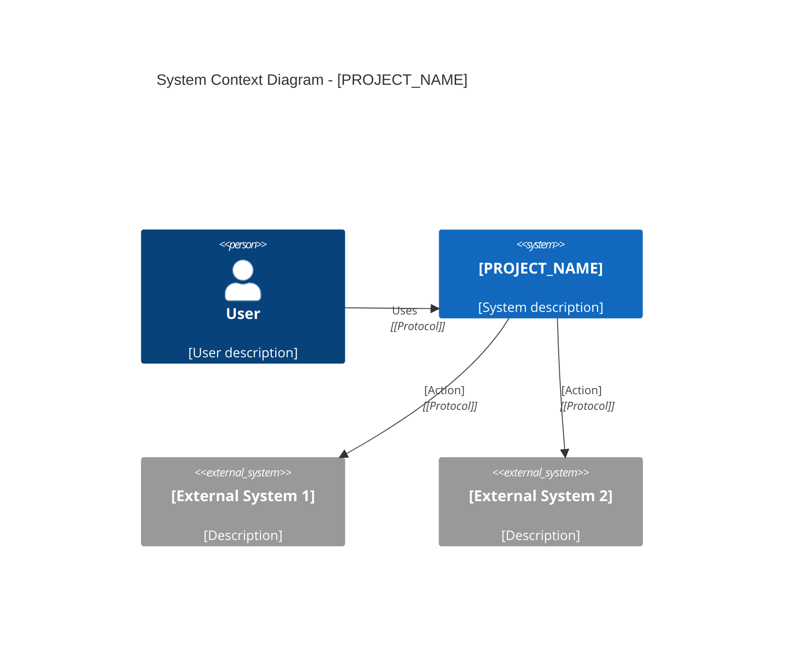
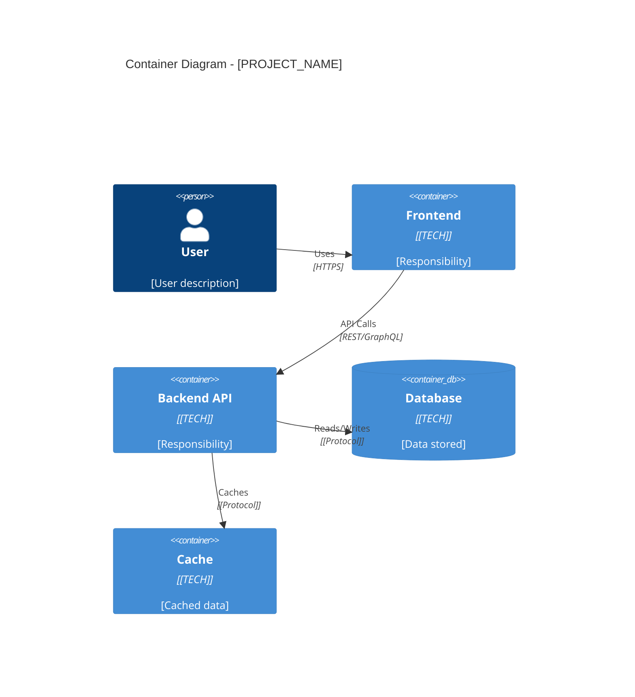
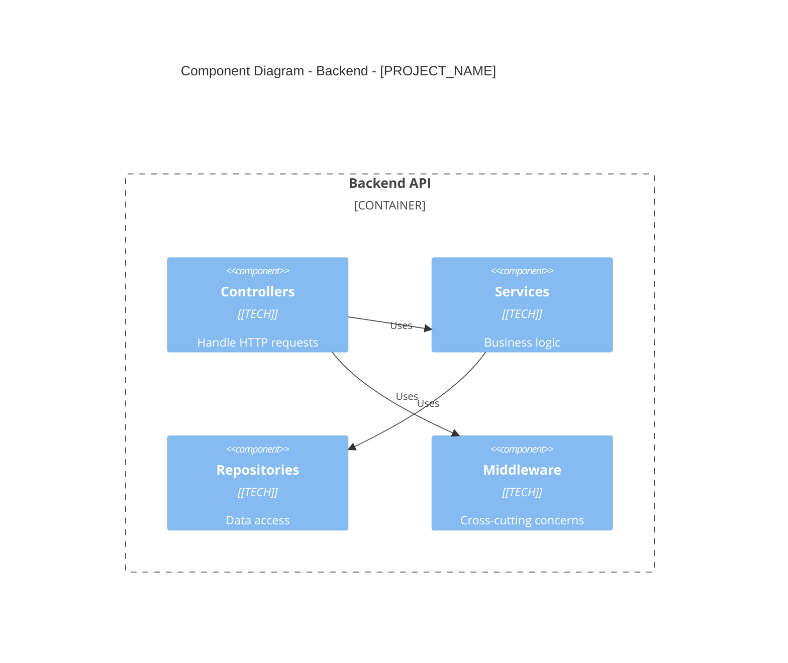
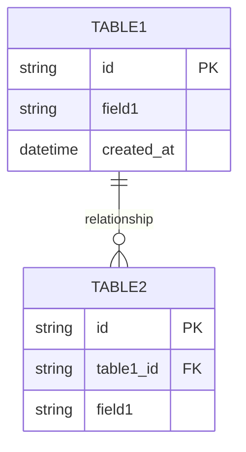

# System Architecture & Logic Reference: [PROJECT_NAME]

> **Generated by:** Architecture Audit Agent
> **Date:** [YYYY-MM-DD]
> **Codebase Version / Commit:** [if detectable]

This document provides a complete technical mapping of **[Project Name]** for AI-driven development and human onboarding.

**Detected Tech Stack:** [Language(s)] · [Framework(s)] · [Database(s)] · [Key Libraries]

---

## Table of Contents

1. Project Overview & Technology Stack
2. System Context (C4 Level 1)
3. Container Architecture (C4 Level 2)
4. Component Breakdown (C4 Level 3)
5. Data Layer & Schema Reference
6. Feature Catalog & API Reference
7. Developer Onboarding & Operational Context
8. Technical Debt & Risk Register

---

## 1. Project Overview & Technology Stack

### 1.1 Technology Manifest

| Category | Technology | Version | Source |
|----------|------------|---------|--------|
| Language | [DETECTED] | [VERSION] | [FILE] |
| Framework | [DETECTED] | [VERSION] | [FILE] |
| Database | [DETECTED] | [VERSION] | [FILE] |
| ORM | [DETECTED] | [VERSION] | [FILE] |
| Message Broker | [DETECTED] | [VERSION] | [FILE] |
| Cache | [DETECTED] | [VERSION] | [FILE] |
| Third-party Services | [DETECTED] | [VERSION] | [FILE] |

### 1.2 Project Directory Tree

```
[PROJECT_NAME]/
├── [TOP LEVEL 1]
│   └── [SECOND LEVEL]
│       └── [THIRD LEVEL]
├── [TOP LEVEL 2]
└── [TOP LEVEL 3]
```

### 1.3 Configuration Files

| File | Purpose | Key Settings |
|------|---------|--------------|
| [FILE] | [DESCRIPTION] | [KEY CONFIG] |

---

## 2. System Context (C4 Level 1)

### 2.1 System Purpose

[1-2 sentences describing what this system does and its primary business value]

### 2.2 Context Diagram



### 2.3 Actor / System Interactions

| Actor / System | Type | Interaction Summary |
|----------------|------|---------------------|
| [ACTOR] | Person | [DESCRIPTION of how they interact] |
| [SYSTEM] | External System | [DESCRIPTION of data exchange] |

### 2.4 Inbound / Outbound Data Flows

| Direction | Data | Source/Destination | Format | Trigger |
|-----------|------|-------------------|--------|---------|
| Inbound | [DATA] | [SOURCE] | [FORMAT] | [TRIGGER] |
| Outbound | [DATA] | [DEST] | [FORMAT] | [TRIGGER] |

---

## 3. Container Architecture (C4 Level 2)

### 3.1 Container Diagram



### 3.2 Container Details

| Container | Technology | Responsibility | Communicates With | Port/URL |
|-----------|------------|----------------|-------------------|----------|
| [NAME] | [TECH] | [DESC] | [OTHER CONTAINERS] | [PORT] |

### 3.3 Communication Protocols

| From | To | Protocol | Purpose |
|------|-----|----------|---------|
| [CONTAINER] | [CONTAINER] | [PROTOCOL] | [PURPOSE] |

---

## 4. Component Breakdown (C4 Level 3)

### 4.1 Backend Component Diagram



### 4.2 Component Registry

| Component | Layer | File Path(s) | Responsibility |
|-----------|-------|--------------|----------------|
| [NAME] | [Controller/Service/Repository/Middleware/Util] | [PATH] | [DESC] |

### 4.3 Architectural Layers

| Layer | Purpose | Components |
|-------|---------|------------|
| Routes/Controllers | HTTP handling | [LIST] |
| Services/Use-Cases | Business logic | [LIST] |
| Repositories/DAOs | Data access | [LIST] |
| Middleware | Cross-cutting | [LIST] |
| Utilities | Helpers | [LIST] |

### 4.4 Cross-Cutting Concerns

| Concern | Implementation | File Path |
|---------|----------------|-----------|
| Authentication | [DESC] | [PATH] |
| Authorization | [DESC] | [PATH] |
| Error Handling | [DESC] | [PATH] |
| Logging | [DESC] | [PATH] |
| Validation | [DESC] | [PATH] |

---

## 5. Data Layer & Schema Reference

### 5.1 Entity-Relationship Diagram



### 5.2 Table / Collection Schemas

#### [TABLE_NAME]

| Column | Type | Nullable | Default | Constraints | Description |
|--------|------|----------|---------|-------------|-------------|
| [COLUMN] | [TYPE] | [YES/NO] | [DEFAULT] | [CONSTRAINTS] | [DESC] |

**Indexes:**
| Name | Columns | Type | Purpose |
|------|---------|------|---------|
| [NAME] | [COLUMNS] | [UNIQUE/INDEX] | [PURPOSE] |

**Foreign Keys:**
| Column | References | On Delete | On Update |
|--------|------------|-----------|-----------|
| [COLUMN] | [TABLE.COLUMN] | [ACTION] | [ACTION] |

### 5.3 ORM / ODM Models

| Model | File Path | Table/Collection | Key Methods |
|-------|-----------|------------------|-------------|
| [MODEL] | [PATH] | [TABLE] | [METHODS] |

### 5.4 Cache / Session Store

| Key Pattern | TTL | Purpose | Data Structure |
|-------------|-----|---------|----------------|
| [PATTERN] | [TTL] | [PURPOSE] | [STRUCTURE] |

---

## 6. Feature Catalog & API Reference

### 6.1 Feature Catalog

| # | Feature Name | UI Entry Point | API Endpoint(s) | Backend Logic | DB Tables |
|---|--------------|----------------|-----------------|---------------|-----------|
| 1 | [NAME] | [ROUTE/PAGE] | [ENDPOINT] | [FILE:FUNC] | [TABLES] |

### 6.2 API Reference

| Method | Endpoint | Auth Required | Request Body | Success Response | Error Codes |
|--------|----------|---------------|--------------|------------------|-------------|
| [METHOD] | [PATH] | [Yes/No] | [SCHEMA] | [RESPONSE] | [CODES] |

### 6.3 Request / Response Schemas

#### [ENDPOINT_NAME]

**Request:**
```json
{
  "field1": "type",
  "field2": "type"
}
```

**Response:**
```json
{
  "field1": "type",
  "field2": "type"
}
```

---

## 7. Developer Onboarding & Operational Context

### 7.1 Prerequisites

| Requirement | Version | Installation |
|-------------|---------|--------------|
| [REQUIREMENT] | [VERSION] | [INSTRUCTIONS] |

### 7.2 Environment Variables

| Variable | Purpose | Example | Required | Default |
|----------|---------|---------|----------|---------|
| [NAME] | [DESC] | [VALUE] | [Yes/No] | [DEFAULT] |

### 7.3 Startup Sequence

```bash
# 1. Install dependencies
[INSTALL COMMAND]

# 2. Configure environment
[CONFIG COMMAND]

# 3. Initialize database
[DB INIT COMMAND]

# 4. Start application
[START COMMAND]
```

### 7.4 Core User Flow (Happy Path)

**Flow:** [FLOW NAME]

| Step | Component | File Path | Description |
|------|-----------|-----------|-------------|
| 1 | [COMP] | [PATH] | [DESC] |
| 2 | [COMP] | [PATH] | [DESC] |
| 3 | [COMP] | [PATH] | [DESC] |

### 7.5 Authentication & Authorization

| Aspect | Implementation | File Path |
|--------|----------------|-----------|
| Auth Type | [JWT/Session/OAuth/API Key] | [PATH] |
| Token Validation | [DESC] | [PATH] |
| Role/Permission Model | [DESC] | [PATH] |

### 7.6 Error Handling Patterns

| Error Type | HTTP Code | Response Format | File Path |
|------------|-----------|-----------------|-----------|
| [TYPE] | [CODE] | [FORMAT] | [PATH] |

---

## 8. Technical Debt & Risk Register

### 8.1 Technical Debt

| # | Location | Issue | Severity | Suggested Fix | Notes |
|---|----------|-------|----------|---------------|-------|
| 1 | [FILE:LINE] | [ISSUE] | [Low/Medium/High/Critical] | [FIX] | [NOTES] |

### 8.2 Deprecated Dependencies

| Package | Current | Latest | Severity | Notes |
|---------|---------|--------|----------|-------|
| [PACKAGE] | [VERSION] | [LATEST] | [SEVERITY] | [NOTES] |

### 8.3 Security Concerns

| # | Location | Concern | Severity | Recommendation |
|---|----------|---------|----------|----------------|
| 1 | [FILE:LINE] | [CONCERN] | [SEVERITY] | [RECOMMENDATION] |

### 8.4 Fragile Logic

| # | Location | Issue | Risk | Suggested Improvement |
|---|----------|-------|------|----------------------|
| 1 | [FILE:LINE] | [ISSUE] | [RISK] | [IMPROVEMENT] |

---

*Document generated by Architecture Audit Agent*
